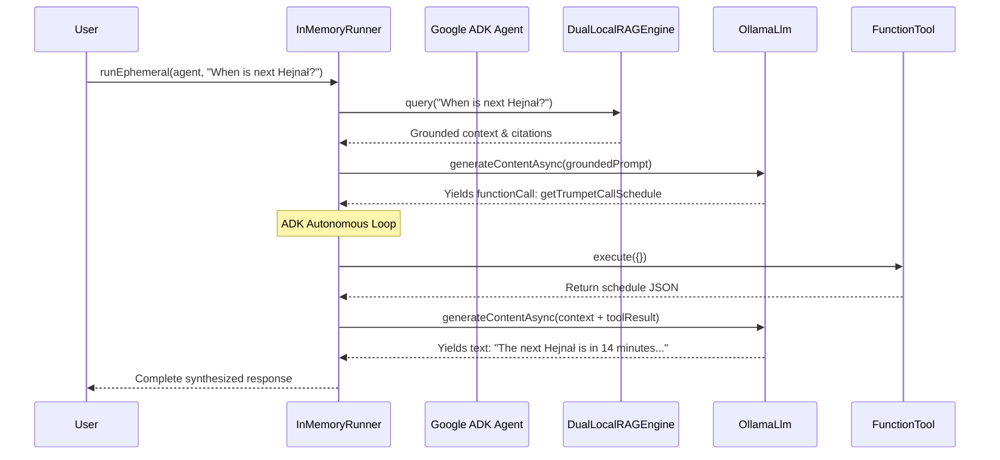

<!-- _class: title-slide -->


<div class="gde-badge">
  <span class="gde-dot g-blue"></span>
  <span class="gde-dot g-red"></span>
  <span class="gde-dot g-yellow"></span>
  <span class="gde-dot g-green"></span>
  Google Developer Experts &bull; DevFest Kraków 2026
</div>

# Building a Local-First Cultural AI Assistant
## Full-Stack Masterclass with Google ADK, Gemma 4, and In-Memory Dual-Layer RAG

**Speaker:** Nuno Andrade &bull; Google Developer Expert (GDE) | **Event:** DevFest Kraków 2026  
**Runtime:** 100% On-Device Node.js LTS | Local Gemma 4 via Ollama | Zero Vector DB Bloat  

<!-- _notes:
Welcome everyone to DevFest Kraków 2026! Today we are building a production-grade, local-first AI Tour Guide and Concierge for the Royal Capital City of Kraków. We will use Google ADK, Gemma 4 running on Ollama, and an in-memory dual-layer RAG engine in pure JavaScript.
-->

---

## Speaker Introduction

<div class="grid-2">
  <div class="card">
    <div class="gde-badge">
      <span class="gde-dot g-blue"></span>
      <span class="gde-dot g-green"></span>
      Nuno Andrade &bull; Google Developer Expert
    </div>
    <h3>AI/ML & Web Technologies</h3>
    <p>Passionate about on-device machine learning, agentic architectures, and building lean, resilient software systems without unnecessary cloud dependencies.</p>
    <ul>
      <li>Active GDG & GDE community mentor</li>
      <li>Production Node.js & Distributed Systems architect</li>
      <li>Advocate for privacy-preserving, local-first AI</li>
      <li><strong>LinkedIn:</strong> <a href="https://www.linkedin.com/in/nuno-andrade-964b2416">linkedin.com/in/nuno-andrade-964b2416</a></li>
    </ul>
  </div>
  <div class="card-highlight">
    <h3>DevFest Kraków 2026 Masterclass</h3>
    <p><strong>Today's Goal:</strong> Transition from toy AI API wrappers to robust, production-ready AI agents using Google's official Agent Development Kit (ADK).</p>
    <p><strong>Core Philosophy:</strong></p>
    <ul>
      <li><strong>Local First:</strong> Privacy, zero API bills, full offline support.</li>
      <li><strong>Zero DB Bloat:</strong> In-memory lexical search beats vector DBs for domain tasks.</li>
      <li><strong>Official Standards:</strong> Google ADK component lifecycle.</li>
    </ul>
  </div>
</div>

<!-- _notes:
Introduce yourself and set the tone: we are here to write real, production-grade code. Not simple OpenAI wrapper scripts, but an architecture that solves real enterprise problems like offline reliability, memory efficiency, and privacy.
-->

---

## The AI Agent Paradigm Shift

<div class="grid-2">
  <div class="card">
    <h3>The Cloud AI Anti-Pattern</h3>
    <ul>
      <li><strong>Unpredictable Costs:</strong> Metred per-token API bills that explode under load.</li>
      <li><strong>Privacy Risk:</strong> Sending sensitive user queries and city data to third-party servers.</li>
      <li><strong>Latency Tax:</strong> 300ms-800ms pure HTTP roundtrip before token generation begins.</li>
      <li><strong>Brittle Infrastructure:</strong> Requires Dockerized vector DBs, Python daemons, and microservices.</li>
    </ul>
  </div>
  <div class="card-green">
    <h3>The Local-First Modern Standard</h3>
    <ul>
      <li><strong>100% On-Device:</strong> Local model (Gemma 4 <code>gemma4:e2b</code> or Gemma 2 <code>gemma2:2b</code> via <code>OLLAMA_MODEL</code>) runs on user hardware via Ollama.</li>
      <li><strong>Zero External Vector DB:</strong> In-memory BM25 retrieval finishes in <strong>&lt; 2 milliseconds</strong>.</li>
      <li><strong>Zero-Downtime Hot Reload:</strong> Edit markdown files live without server restarts.</li>
      <li><strong>Unified Node.js ESM:</strong> Google ADK Agent + Express SPA in a single process.</li>
    </ul>
  </div>
</div>

<!-- _notes:
Emphasize why local AI is a game changer for venues like museums, city kiosks, and privacy-conscious enterprises. Explain why vector databases are frequently an over-engineered anti-pattern for domain-specific tasks.
-->

---

## Workshop Architecture Blueprint

<div class="card-highlight" style="margin-bottom: 16px;">
  <strong>Single Node.js Process Architecture:</strong> Concurrently serves the user-facing web app and official developer tooling while sharing agent state, models, and RAG cache.
</div>

<div class="grid-3">
  <div class="card">
    <span class="pill pill-blue">Frontend & API</span>
    <h3>Port 3030: Express 5</h3>
    <ul>
      <li>Vanilla HTML5/CSS3 SPA</li>
      <li>Zero build tools (no Vite)</li>
      <li>Grounding citations display</li>
      <li>Tool execution badges</li>
    </ul>
  </div>
  <div class="card">
    <span class="pill pill-green">Orchestration</span>
    <h3>Google ADK Agent</h3>
    <ul>
      <li><code>Agent</code> & <code>InMemoryRunner</code></li>
      <li>Custom <code>OllamaLlm</code> (BaseLlm)</li>
      <li>Native <code>FunctionTool</code> wraps</li>
      <li>Offline Direct Mode fallback</li>
    </ul>
  </div>
  <div class="card">
    <span class="pill pill-yellow">Evaluation</span>
    <h3>Port 8000: ADK Dev-UI</h3>
    <ul>
      <li>Official <code>AdkApiServer</code></li>
      <li>Visual agent graph explorer</li>
      <li>Step-by-step trace inspection</li>
      <li>Tool payload debugger</li>
    </ul>
  </div>
</div>

<!-- _notes:
Walk through the 3 pillars of the architecture: Express for the client app on 3030, Google ADK running the core agent loop, and the official ADK Dev-UI running concurrently on port 8000.
-->

---

## 6-Step Progressive Curriculum Roadmap

| Step | Milestone | Tech & Capabilities | Automated Tests |
| :---: | :--- | :--- | :---: |
| **01** | **Setup & Local LLM** | Ollama daemon, Gemma 4 / Gemma 2 via `OLLAMA_MODEL`, Node.js client | 5 tests |
| **02** | **Dual-Layer RAG Engine** | In-memory BM25, Polish diacritics, markdown chunking, `mtime` hot-reload | 9 tests |
| **03** | **Native Tool Binding** | JSON Schema declarations, Hejnał time math, Wawel ticket simulator | 7 tests |
| **04** | **Google ADK Orchestration** | `@google/adk`, `BaseLlm`, `FunctionTool`, `InMemoryRunner` tool loops | 23 tests |
| **05** | **Full Application & UI** | Unified Express SPA (:3030) + Google ADK Web Dev-UI (:8000) dual listener | 35 tests |
| **06** | **Google Search MCP** | Model Context Protocol stdio server, live search & dynamic cross-content | 42 tests |
| **TOTAL** | **All 6 Steps Combined** | **Full production local cultural concierge application** | **121 tests** |

<!-- _notes:
Review the roadmap. Emphasize that all 6 steps have independent, self-contained folders with working code and automated tests. If any attendee falls behind, they can jump directly to any step folder!
-->

---

## Workshop Logistics & Repository Navigation

<div class="grid-2">
  <div class="card">
    <h3>Self-Contained Step Folders</h3>
    <pre><code>steps/
├── step-01-setup-and-llm/
├── step-02-dual-layer-rag/
├── step-03-native-tools/
├── step-04-adk-agent/
├── step-05-full-app/
└── step-06-google-search-mcp/</code></pre>
    <p>Each directory contains its own <code>package.json</code>, source code, automated test suite, and exhaustive README.</p>
  </div>
  <div class="card-highlight">
    <h3>Global Workspace Commands</h3>
    <pre><code># Install all dependencies
npm install

# Run all 121 tests across 6 steps
npm test

# Run tests for a specific step
npm run test:step-01
npm run test:step-06

# Launch the unified application
npm start</code></pre>
  </div>
</div>

<!-- _notes:
Explain the repo layout. Emphasize that all tests run using Node.js's native test runner (node:test) with zero external testing frameworks.
-->

---

<!-- _class: section-header -->

<div class="gde-badge">
  <span class="gde-dot g-blue"></span>
  Step 01
</div>

# Step 01: Setup & Local LLM Connectivity
## Harnessing Google's Gemma 4 on Local Hardware via Ollama

---

## Prerequisites: Install Node.js & Ollama
### Quick Installation Guide for Linux & macOS

<div class="grid-2">
  <div class="card">
    <span class="pill pill-blue">1. Node.js LTS via NVM</span>
    <h3>Node Version Manager (Linux & macOS)</h3>
    <pre><code># 1. Install NVM
curl -o- https://raw.githubusercontent.com/nvm-sh/nvm/v0.40.1/install.sh | bash
# 2. Reload shell configuration
source ~/.nvm/nvm.sh
# 3. Install & use Node.js 22 LTS
nvm install 22
nvm use 22
node -v   # Expected: v22.x.x
npm -v    # Expected: 10.x.x+</code></pre>
  </div>
  <div class="card-highlight">
    <span class="pill pill-green">2. Local Ollama Daemon</span>
    <h3>Ollama Installation & Startup</h3>
    <p><strong>Linux Installation:</strong></p>
    <pre><code>curl -fsSL https://ollama.com/install.sh | sh</code></pre>
    <p><strong>macOS Installation:</strong></p>
    <pre><code>brew install ollama</code></pre>
    <p><strong>Start Daemon & Pull Model:</strong></p>
    <pre><code>ollama serve              # Start daemon in terminal
ollama pull gemma4:e2b    # Default model (~1.8 GB)
# Fallback: ollama pull gemma2:2b</code></pre>
  </div>
</div>

<!-- _notes:
Guide attendees through installing Node.js LTS via NVM and Ollama on Linux/macOS. Remind everyone to keep ollama serve running in a dedicated terminal.
-->

---

## Why Gemma & Ollama?

<div class="grid-3">
  <div class="card">
    <h3>High-Speed Inference</h3>
    <p>Runs locally via Ollama with fast CPU/GPU inference (~1.8 GB VRAM for <code>gemma4:e2b</code> or <code>gemma2:2b</code>).</p>
  </div>
  <div class="card">
    <h3>Dynamic Configuration</h3>
    <p>Zero hardcoded models! Configured via <code>OLLAMA_MODEL</code> in <code>.env</code> with instant fallback.</p>
  </div>
  <div class="card">
    <h3>Instruction-Tuned</h3>
    <p>Fine-tuned for structured instruction following, JSON output generation, and seamless tool call decisions.</p>
  </div>
</div>

<div class="card-highlight" style="margin-top: 18px;">
  <strong>Verify Local Setup in Terminal:</strong>
  <pre><code>ollama serve              # Ensure daemon is running
ollama pull gemma4:e2b    # Default model (~1.8 GB)
# Or for lower RAM: ollama pull gemma2:2b
export OLLAMA_MODEL=gemma4:e2b</code></pre>
</div>

<!-- _notes:
Highlight that Gemma is Google's state-of-the-art open model family. Point out that the model is fully configurable via the OLLAMA_MODEL environment variable!
-->

---

## Step 01: Node.js Connectivity (`src/llm.js`)

<div class="grid-2">
  <div class="card">
    <h3>1. Config & Health Check</h3>
    <pre><code>export const OLLAMA_MODEL = 
  process.env.OLLAMA_MODEL || 
  process.env.MODEL || 'gemma4:e2b';

export async function checkOllamaHealth(
  client = createOllamaClient(), 
  targetModel = OLLAMA_MODEL
) {
  const res = await client.list();
  const names = res.models.map(m => m.name);
  return { 
    online: true, 
    modelFound: names.includes(targetModel) 
  };
}</code></pre>
  </div>
  <div class="card">
    <h3>2. Deterministic Inference</h3>
    <pre><code>export async function queryGemma(prompt, opts) {
  const client = opts.client || createOllamaClient();
  const model = opts.model || OLLAMA_MODEL;
  const res = await client.generate({
    model,
    prompt,
    stream: false,
    options: {
      temperature: 0.2 // Low temp for facts!
    }
  });
  return {
    response: res.response.trim(),
    durationMs: Date.now() - start
  };
}</code></pre>
  </div>
</div>

<!-- _notes:
Walk through the code. Point out the low temperature (0.2) to prevent creative hallucinations on factual history, and the defensive health check that allows graceful degradation.
-->

---

## Step 01: Hands-On Verification

<div class="card-highlight">
  <h3>Run Step 1 Verification Script</h3>
  <pre><code>cd steps/step-01-setup-and-llm
cp .env.example .env
npm start</code></pre>
</div>

<div class="card" style="margin-top: 14px;">
  <strong>Expected Console Output:</strong>
  <pre><code>Checking local Ollama connectivity at: http://127.0.0.1:11434
Target Model: gemma4:e2b
Ollama daemon is ONLINE.
Available models: gemma4:e2b
Model "gemma4:e2b" is ready locally!

Sending test query to Gemma 4: "Summarize Kraków in one short sentence."
Gemma 4 Response: Kraków is a historic Polish city renowned for its preserved medieval Old Town, royal Wawel Castle, and vibrant cultural heritage.
Duration: 1173ms</code></pre>
</div>

<p><span class="pill pill-green">5 Automated Tests Passing</span> Run <code>npm test</code> to verify unit test coverage.</p>

<!-- _notes:
Ask attendees to run npm start in step-01. Confirm that everyone sees the green output and sub-2-second inference.
-->

---

<!-- _class: section-header -->

<div class="gde-badge">
  <span class="gde-dot g-red"></span>
  Step 02
</div>

# Step 02: Dual-Layer RAG Engine
## Eliminating Vector Database Bloat with In-Memory Lexical Retrieval

---

## Why Vector Databases are Overkill for Local RAG

<div class="grid-2">
  <div class="card">
    <h3>The Vector DB Trap</h3>
    <ul>
      <li><strong>Scale Mismatch:</strong> Built for billions of vectors; domain knowledge is ~50-500 paragraphs (&lt; 2 MB).</li>
      <li><strong>VRAM Tax:</strong> Embedding model steals 1.5 GB VRAM from the generative LLM.</li>
      <li><strong>Double Latency:</strong> Generating query embeddings adds 50ms-200ms overhead.</li>
      <li><strong>Semantic Drift:</strong> Dense vectors confuse numbers, prices, and specific codes.</li>
    </ul>
  </div>
  <div class="card-green">
    <h3>Our In-Memory Lexical Engine</h3>
    <ul>
      <li><strong>Zero Dependencies:</strong> 100% native Node.js standard library.</li>
      <li><strong>Sub-Millisecond Speed:</strong> BM25 RAM traversal finishes in <strong>&lt; 2 ms</strong>.</li>
      <li><strong>Exact Precision:</strong> BM25 rewards exact keyword matches (e.g. "Dragon's Den PLN").</li>
      <li><strong>Instant Hot Reload:</strong> Filesystem <code>mtime</code> cache updates automatically.</li>
    </ul>
  </div>
</div>

<!-- _notes:
This is a pivotal concept for the workshop. Challenge the conventional wisdom that RAG always requires a vector database. For local, domain-specific apps, an in-memory lexical engine is faster, leaner, and more accurate.
-->

---

## The Dual-Layer Knowledge Architecture

<div class="grid-2">
  <div class="card">
    <span class="pill pill-blue">Layer 1: Static Corpus</span>
    <h3>Immutable Historical Knowledge</h3>
    <p>Compiled historical facts that rarely change:</p>
    <ul>
      <li><strong>Wawel Royal Hill:</strong> Casimir the Great, Renaissance courtyard, Smok Wawelski dragon legend.</li>
      <li><strong>St. Mary's Basilica:</strong> Veit Stoss carved wood altarpiece, asymmetric towers, 1241 Mongol siege.</li>
      <li><strong>Main Market Square:</strong> 1257 Magdeburg charter layout, Sukiennice Cloth Hall.</li>
      <li><strong>Kazimierz:</strong> 1335 royal charter, Old Synagogue, Schindler's Factory.</li>
    </ul>
  </div>
  <div class="card-highlight">
    <span class="pill pill-yellow">Layer 2: Mutable Dynamic</span>
    <h3>Live Hot-Reloading Markdown</h3>
    <p>Frequently changing operational data in <code>data/mutable/</code>:</p>
    <ul>
      <li><code>wawel_pricing.md</code>: Admission prices, free Monday policies, ticket contacts.</li>
      <li><code>tourist_services.md</code>: Emergency lines (112, 997, 986), InfoKraków visitor centers, luggage storage.</li>
      <li><strong>Zero Downtime:</strong> Edit any <code>.md</code> file on disk; the engine updates in RAM on the next request!</li>
    </ul>
  </div>
</div>

<!-- _notes:
Explain the two-tier structure. Static facts stay locked in code for speed; mutable data lives in markdown files where non-developers (curators, event organizers) can edit them.
-->

---

## Polish Diacritics & BM25 Scoring

<div class="grid-2">
  <div class="card">
    <h3>Diacritic Normalization</h3>
    <pre><code>export function tokenize(text) {
  if (!text || typeof text !== 'string') return [];
  return text
    .toLowerCase()
    .normalize('NFD') // Decompose accents
    .replace(/[\u0300-\u036f]/g, '') // Strip marks
    .replace(/[^\w\s]/g, ' ')
    .split(/\s+/)
    .filter(t => t.length > 2 && !STOP_WORDS.has(t));
}</code></pre>
    <p>Normalizes Polish letters (<code>ą&rarr;a</code>, <code>ć&rarr;c</code>, <code>ł&rarr;l</code>, <code>ż&rarr;z</code>) so searches work regardless of keyboard layout.</p>
  </div>
  <div class="card">
    <h3>Filesystem <code>mtime</code> Invalidation</h3>
    <pre><code>// In DualLocalRAGEngine
const stats = fs.statSync(filePath);
if (this.cache[file]?.mtime === stats.mtimeMs) {
  // Cache Hit: sub-millisecond RAM read!
  chunks.push(...this.cache[file].chunks);
  continue;
}
// Cache Miss: re-chunk markdown heading sections
const content = fs.readFileSync(filePath, 'utf8');
const fresh = chunkMarkdown(content, file);
this.cache[file] = { mtime: stats.mtimeMs, chunks: fresh };</code></pre>
  </div>
</div>

<!-- _notes:
Walk through the tokenization code. Highlight the NFD normalization trick and how mtimeMs enables zero-downtime hot-reloading with zero background polling overhead.
-->

---

## Step 02: Hands-On Live Hot-Reload Lab

<div class="grid-2">
  <div class="card">
    <h3>1. Run Unit Tests</h3>
    <pre><code>cd steps/step-02-dual-layer-rag
npm test</code></pre>
    <p><span class="pill pill-green">9 Tests Pass in ~20ms</span></p>
    <ul>
      <li>Tokenization & diacritic preservation</li>
      <li>Heading-based markdown chunking</li>
      <li>Static & mutable query retrieval</li>
      <li>Dynamic hot-reloading verification</li>
    </ul>
  </div>
  <div class="card-highlight">
    <h3>2. Try Live Hot-Reloading!</h3>
    <ol>
      <li>Open <code>data/mutable/wawel_pricing.md</code>.</li>
      <li>Change State Rooms price from <code>35 PLN</code> to <code>55 PLN</code>.</li>
      <li>Save the file.</li>
      <li>Re-run test or query: the engine immediately retrieves the updated <code>55 PLN</code> price!</li>
    </ol>
    <p><strong>Zero downtime. Zero re-indexing pipeline.</strong></p>
  </div>
</div>

<!-- _notes:
Have attendees execute the test and then manually edit wawel_pricing.md. Ask them to verify that the changed price appears instantly on the next query.
-->

---

<!-- _class: section-header -->

<div class="gde-badge">
  <span class="gde-dot g-yellow"></span>
  Step 03
</div>

# Step 03: Native Tool Binding & Execution
## Grounding Language Models in Real-Time Calculations and Systems

---

## The LLM Function Calling Protocol

```
+---------------+    1. "When is next Hejnał?"     +--------------------+
|               | -------------------------------> |                    |
| User / Client |                                  | Gemma 4 / Google   |
|               | <------------------------------- | ADK Orchestrator   |
+---------------+   4. Synthesized Answer          +--------------------+
                                                     |        ^
                       2. functionCall:              |        | 3. Tool Return:
                          getTrumpetCallSchedule({}) |        |    Schedule JSON
                                                     v        |
                                                   +--------------------+
                                                   | Native JavaScript  |
                                                   | Tools (src/tools)  |
                                                   +--------------------+
```

<div class="card-highlight">
  <strong>Why Tools are Vital:</strong> LLMs cannot tell the current time, compute modulo arithmetic reliably, or know real-time museum ticket quotas. Tools give the agent <em>hands and eyes</em>.
</div>

<!-- _notes:
Explain the function calling protocol. Gemma 4 emits structured JSON specifying tool name and arguments. The host executes the JS function and feeds the structured response back into the context.
-->

---

## The Three Native Domain Tools

<div class="grid-3">
  <div class="card">
    <span class="pill pill-blue">Tool 1: Schedule Math</span>
    <h3><code>getTrumpetCallSchedule</code></h3>
    <ul>
      <li>Computes minutes remaining until the next hourly <em>Hejnał Mariacki</em>.</li>
      <li>Returns 4 cardinal dedications: South (King), West (Mayor), North (Guard), East (Fire Chief).</li>
      <li>Details the 1241 Mongol siege acoustic cutoff.</li>
    </ul>
  </div>
  <div class="card">
    <span class="pill pill-green">Tool 2: Inventory Simulator</span>
    <h3><code>getWawelTicketAvailability</code></h3>
    <ul>
      <li>Simulates live capacity across State Rooms, Royal Crypts, and Dragon's Den.</li>
      <li>Handles dates, defaults to today.</li>
      <li>Enforces Monday free-admission rules.</li>
      <li>Flags sold-out alerts.</li>
    </ul>
  </div>
  <div class="card">
    <span class="pill pill-yellow">Tool 3: Curated Guide</span>
    <h3><code>recommendLocalDining</code></h3>
    <ul>
      <li>Filters by district: <code>Old Town</code>, <code>Kazimierz</code>, <code>Podgórze</code>.</li>
      <li>Filters by budget tier: <code>budget</code> / <code>milk bar</code>, <code>moderate</code>, <code>fine dining</code>.</li>
      <li>Includes Bar Mleczny Górnik and 2-star Bottiglieria 1881.</li>
    </ul>
  </div>
</div>

<!-- _notes:
Walk through each of the 3 tools. Highlight how they reflect authentic Kraków culture and operational realities (such as Wawel Castle free entry on Mondays).
-->

---

## Declaring Tools with JSON Schema

```javascript
export const toolDefinitions = [
  {
    type: 'function',
    function: {
      name: 'getWawelTicketAvailability',
      description: 'Check real-time ticket availability and remaining capacity for Wawel Castle exhibitions.',
      parameters: {
        type: 'object',
        properties: {
          date: {
            type: 'string',
            description: 'Visit date in YYYY-MM-DD format. Defaults to today if omitted.'
          }
        },
        required: []
      }
    }
  }
];
```

*   **Self-Describing Contracts:** The LLM reads the `description` to determine **intent**.
*   **Runtime Dispatch:** Dynamic execution via registry: `await toolsByName[toolName](args)`.

<!-- _notes:
Show the JSON Schema structure. Emphasize that clear, descriptive parameters and enums make all the difference in helping the model choose the right tool at the right time.
-->

---

## Step 03: Hands-On Tool Verification

<div class="grid-2">
  <div class="card-highlight">
    <h3>Execute Tool Unit Tests</h3>
    <pre><code>cd steps/step-03-native-tools
npm test</code></pre>
    <p><span class="pill pill-green">7 Automated Tests Passing</span></p>
    <ul>
      <li>Real-time minute calculation math</li>
      <li>Cardinal direction dedications</li>
      <li>Museum exhibition capacity simulation</li>
      <li>District & budget dining filter logic</li>
      <li>JSON Schema export validity</li>
    </ul>
  </div>
  <div class="card">
    <h3>Direct Execution in Node REPL</h3>
    <pre><code>// Direct invocation without LLM
import { getTrumpetCallSchedule } 
  from './src/tools.js';

const res = await getTrumpetCallSchedule();
console.log(res);
// {
//   nextOccurrenceInMinutes: 34,
//   nextScheduledTime: "11:00",
//   cardinalDirections: [...]
// }</code></pre>
  </div>
</div>

<!-- _notes:
Run npm test for step-03. Note how tool testing is completely decoupled from the LLM, making unit testing fast and deterministic.
-->

---

<!-- _class: section-header -->

<div class="gde-badge">
  <span class="gde-dot g-green"></span>
  Step 04
</div>

# Step 04: Google ADK Orchestration
## Assembling Autonomous Multi-Turn Agent Loops with `@google/adk`

---

## Official Google ADK Component Architecture

<div class="grid-2">
  <div class="card">
    <h3>The Google ADK Object Model</h3>
    <ul>
      <li><strong><code>Agent</code>:</strong> High-level container encapsulating name, instruction, model instance, and registered tools.</li>
      <li><strong><code>BaseLlm</code>:</strong> Abstract base class for language models. Defines <code>async *generateContentAsync()</code> generator contract.</li>
      <li><strong><code>FunctionTool</code>:</strong> Typed tool wrapper that validates input payloads and executes native JS functions.</li>
      <li><strong><code>InMemoryRunner</code>:</strong> Coordinates conversational turns and drives autonomous tool-execution loops.</li>
    </ul>
  </div>
  <div class="card-highlight">
    <h3>Why Google ADK?</h3>
    <ul>
      <li>Official Google framework for agentic workflows in Node.js and TypeScript.</li>
      <li>Standardized streaming and telemetry abstractions.</li>
      <li>Full compatibility with Google developer ecosystem and DevTools.</li>
      <li>Decoupled from specific model vendors (supports Gemini, Gemma, custom LLMs).</li>
    </ul>
  </div>
</div>

<!-- _notes:
Introduce the Google ADK core classes. Explain that ADK gives us a clean, formal lifecycle for agents instead of ad-hoc prompt-formatting loops.
-->

---

## Bridging Ollama & ADK: Custom `OllamaLlm`

```javascript
import { BaseLlm } from '@google/adk';

export class OllamaLlm extends BaseLlm {
  constructor({
    model = process.env.OLLAMA_MODEL || process.env.MODEL || 'gemma4:e2b',
    host = process.env.OLLAMA_HOST || 'http://127.0.0.1:11434'
  } = {}) {
    super({ model });
    this.client = new Ollama({ host });
  }

  async *generateContentAsync(llmRequest, stream, abortSignal) {
    const messages = transformAdkContentsToOllama(llmRequest.contents);
    const tools = formatToolsForOllama(llmRequest.tools);

    const response = await this.ollama.chat({ model: this.model, messages, tools });

    yield {
      content: {
        role: 'model',
        parts: response.message.tool_calls 
          ? response.message.tool_calls.map(tc => ({
              functionCall: { id: tc.id, name: tc.function.name, args: tc.function.arguments }
            }))
          : [{ text: response.message.content }]
      },
      finishReason: 'STOP',
      turnComplete: true
    };
  }
}
```

<!-- _notes:
Explain the adapter pattern. OllamaLlm subclasses BaseLlm and maps ADK's llmRequest to Ollama's chat payload, converting Ollama tool calls back into ADK functionCall parts.
-->

---

## Grounded Execution & Autonomous Tool Loop



<!-- _notes:
Walk through the sequence. InMemoryRunner's runEphemeral automates this entire multi-turn exchange seamlessly.
-->

---

## Step 04: Hands-On Verification & Fallback

<div class="grid-2">
  <div class="card-highlight">
    <h3>Run Step 4 Test Suite</h3>
    <pre><code>cd steps/step-04-adk-agent
cp .env.example .env
npm test</code></pre>
    <p><span class="pill pill-green">23 Tests Passing Across 3 Suites</span></p>
    <ul>
      <li>ADK Agent instantiation & prompt grounding</li>
      <li>FunctionTool argument validation</li>
      <li>End-to-end multi-turn tool loops</li>
      <li>Offline fallback resilience</li>
    </ul>
  </div>
  <div class="card">
    <h3>Resilient Offline Fallback Mode</h3>
    <p>What if the Ollama daemon crashes or is restarting?</p>
    <div class="card-green">
      <strong>Grounded RAG Direct Mode:</strong>
      <p>The agent detects daemon unavailability, dispatches relevant tools deterministically, retrieves RAG chunks, and crafts a grounded response without crashing.</p>
    </div>
  </div>
</div>

<!-- _notes:
Have participants run npm test in step-04. Point out the offline test: it proves that even if the LLM process goes down, the assistant continues answering visitors.
-->

---

<!-- _class: section-header -->

<div class="gde-badge">
  <span class="gde-dot g-blue"></span>
  Step 05
</div>

# Step 05: Full Production Application & UI
## Unified Express 5 SPA & Official Google ADK Web Dev-UI

---

## Unified Dual-Port Server Architecture

<div class="card-highlight" style="margin-bottom: 16px;">
  <strong>Single Node.js Process (<code>src/server.js</code>):</strong> Both servers run concurrently, sharing memory, RAG indexes, and the agent instance.
</div>

<div class="grid-2">
  <div class="card">
    <span class="pill pill-blue">Port 3030</span>
    <h3>Express 5 REST API & SPA</h3>
    <ul>
      <li><code>POST /api/chat</code>: Conversational endpoint</li>
      <li><code>GET /api/health</code>: System & RAG telemetry</li>
      <li><code>GET /api/tools</code>: JSON Schema list</li>
      <li><code>POST /api/tools/:name</code>: Direct tool runner</li>
      <li><code>GET /dev-ui</code>: Redirects to port 8000</li>
      <li>Zero build step: vanilla SPA delivery</li>
    </ul>
  </div>
  <div class="card">
    <span class="pill pill-yellow">Port 8000</span>
    <h3>Google ADK Web Dev-UI</h3>
    <ul>
      <li>Powered by <code>@google/adk-devtools</code></li>
      <li>Interactive agent component graph</li>
      <li>Turn-by-turn trace visualizer</li>
      <li>Live state & memory inspector</li>
      <li>Full support for <code>npx adk web</code></li>
    </ul>
  </div>
</div>

<!-- _notes:
Detail how Step 5 unifies everything. Explain that having both ports run in the same process eliminates cross-process communication overhead and keeps the architecture lean.
-->

---

## Pure ESM Root Agent Export for ADK CLI

To allow Google ADK's native CLI (`npx adk web`) to discover and inspect our agent:

```javascript
// krakow_cultural_agent/agent.js
import { Agent } from '@google/adk';
import { OllamaLlm } from '../src/agent.js';
import { getFunctionTools } from '../src/agent.js';

export const rootAgent = new Agent({
  name: 'krakow_cultural_agent',
  description: 'AI Tour Guide and Concierge for the Royal Capital City of Kraków',
  model: new OllamaLlm(),
  tools: getFunctionTools(),
  instruction: 'You are the Kraków Cultural AI Tour Guide and Concierge...'
});
```

*   **Zero Python Dependencies:** Pure JavaScript ESM module.
*   **Standardized Contract:** Exports `rootAgent` as mandated by Google ADK conventions.

<!-- _notes:
Show how krakow_cultural_agent/agent.js exports rootAgent. This allows standard Google ADK tools to inspect the agent seamlessly.
-->

---

## Step 05: Hands-On Full App Launch

<div class="card-highlight">
  <h3>Launch Unified Server</h3>
  <pre><code>cd steps/step-05-full-app
cp .env.example .env
npm start</code></pre>
</div>

<div class="grid-2" style="margin-top: 14px;">
  <div class="card">
    <h3>1. Kraków Tour Concierge SPA</h3>
    <p>Open browser to: <strong><code>http://localhost:3030</code></strong></p>
    <ul>
      <li>Try quick prompt chips</li>
      <li>Observe tool execution badges</li>
      <li>View grounding source attribution</li>
    </ul>
  </div>
  <div class="card">
    <h3>2. Google ADK Web Dev-UI</h3>
    <p>Open browser to: <strong><code>http://localhost:8000/dev-ui</code></strong></p>
    <ul>
      <li>Select <code>krakow_cultural_agent</code></li>
      <li>Inspect the live agent graph</li>
      <li>Examine execution traces & tool calls</li>
    </ul>
  </div>
</div>

<p><span class="pill pill-green">35 Tests Passing in Step 5</span></p>

<!-- _notes:
Invite attendees to launch npm start and open both URLs. Show them the SPA on 3030 and then the Dev-UI on 8000.
-->

---

## Live Demo & Interactive Scenarios

<div class="grid-2">
  <div class="card">
    <span class="pill pill-blue">Scenario 1: Live Schedule</span>
    <h3>"When is the next Hejnał Mariacki?"</h3>
    <ul>
      <li>Agent dispatches <code>getTrumpetCallSchedule()</code></li>
      <li>Returns minutes remaining and 4 directions</li>
      <li>Cites St. Mary's Basilica historical corpus</li>
    </ul>
    <span class="pill pill-green">Scenario 2: Ticket Availability</span>
    <h3>"Are there tickets for Wawel tomorrow?"</h3>
    <ul>
      <li>Agent dispatches <code>getWawelTicketAvailability()</code></li>
      <li>Simulates real-time inventory across exhibitions</li>
    </ul>
  </div>
  <div class="card-highlight">
    <span class="pill pill-yellow">Scenario 3: Zero-Downtime Hot Reload</span>
    <h3>Live Price Update Test</h3>
    <ol>
      <li>Ask: <em>"What is the State Rooms ticket price?"</em> (Agent says 35 PLN).</li>
      <li>Edit <code>data/mutable/wawel_pricing.md</code> to 55 PLN and save.</li>
      <li>Ask again: Agent immediately answers <strong>55 PLN</strong> without restart!</li>
    </ol>
    <span class="pill pill-red">Scenario 4: Observability</span>
    <h3>ADK Dev-UI Inspection</h3>
    <p>Trace the prompt, tool call payload, and model synthesis step-by-step.</p>
  </div>
</div>

<!-- _notes:
Run the live demo on the projector. Demonstrate the hot-reload live—it always wows developers to see zero-downtime updates with pure file mtime.
-->

---

<!-- _class: section-header -->

<div class="gde-badge">
  <span class="gde-dot g-red"></span>
  Step 06
</div>

# Dynamic Cross-Content Grounding
## Model Context Protocol (MCP) & Google Search Server

* Breaking the closed-world limitation of local-first RAG
* Standalone stdio MCP server using `@modelcontextprotocol/sdk`
* Dynamic Kraków events calendar & live Google Custom Search
* First-class integration via Google ADK `MCPToolset`

---

## The Closed-World Problem in Local AI
### Breaking Beyond Static RAG & Local Tool Boundaries

<div class="grid-2">
  <div class="card">
    <span class="pill pill-red">The Local-Only Bottleneck</span>
    <h3>Static Grounding Limits</h3>
    <ul>
      <li>Static corpus only knows pre-indexed history</li>
      <li>Local mutable markdown requires manual authoring</li>
      <li><strong>What about:</strong>
        <ul>
          <li>Annual film & music festivals (KFF, Jewish Culture)?</li>
          <li>Temporary museum exhibits (<em>Lady with an Ermine</em>)?</li>
          <li>Airport commuter rail updates & live weather?</li>
        </ul>
      </li>
    </ul>
  </div>
  <div class="card-highlight">
    <span class="pill pill-green">The Solution</span>
    <h3>Model Context Protocol (MCP)</h3>
    <p>Open standard for dynamic tool discovery & execution over <strong>stdio JSON-RPC</strong>.</p>
    <ul>
      <li>Decouples search infrastructure from LLM logic</li>
      <li>Works with on-device Gemma 4 via Ollama</li>
      <li>First-class integration with <strong>Google ADK</strong></li>
    </ul>
  </div>
</div>

<div class="card" style="margin-top: 14px;">
  <strong>Core Principle:</strong> When local RAG and deterministic tools don't have the answer, the agent autonomously queries the live world through an MCP Search Server.
</div>

<!-- _notes:
Introduce Step 06. Explain why local RAG has a closed-world limitation and how MCP provides standard open tool integration.
-->

---

## The Tri-Layer Knowledge Architecture
### Layered Grounding Strategy for Enterprise AI Agents

<div class="grid-3">
  <div class="card">
    <span class="pill pill-blue">Layer 1: Static RAG</span>
    <h3>Historical Corpus</h3>
    <p>Immutable monuments, architectural facts, and legends.</p>
    <ul>
      <li>Wawel, Basilica, Kazimierz</li>
      <li>In-memory BM25 retrieval</li>
      <li><strong>Latency:</strong> &lt; 1ms</li>
    </ul>
  </div>
  <div class="card">
    <span class="pill pill-yellow">Layer 2: Mutable RAG</span>
    <h3>Live Markdown</h3>
    <p>Operator-editable filesystem data with timestamp caching.</p>
    <ul>
      <li>Pricing, hours, emergency lines</li>
      <li>Zero-downtime <code>mtime</code> reload</li>
      <li><strong>Latency:</strong> &lt; 2ms</li>
    </ul>
  </div>
  <div class="card-highlight">
    <span class="pill pill-green">Layer 3: Dynamic MCP</span>
    <h3>Live Google Search</h3>
    <p>External cross-content and municipal calendar intelligence.</p>
    <ul>
      <li>Festivals, exhibitions, transit</li>
      <li>Stdio JSON-RPC protocol</li>
      <li><strong>Latency:</strong> On-demand</li>
    </ul>
  </div>
</div>

<div class="card" style="margin-top: 14px;">
  <span class="pill pill-blue">Deterministic Hierarchy:</span>
  Local Grounding First &rarr; Domain Functions Second &rarr; External MCP Search Third.
</div>

<!-- _notes:
Explain the Tri-layer hierarchy. Emphasize that MCP search is invoked only when queries require dynamic external context.
-->

---

## Inside the Google Search MCP Server
### Standalone Stdio Process with `@modelcontextprotocol/sdk`

<div class="grid-2">
  <div class="card">
    <h3>Architecture & IPC Transport</h3>
    <pre><code class="language-javascript">// src/mcpServer.js
import { Server } from '@modelcontextprotocol/sdk/server/index.js';
import { StdioServerTransport } from '@modelcontextprotocol/sdk/server/stdio.js';

const server = new Server({
  name: 'google-search-mcp-server',
  version: '1.0.0'
}, { capabilities: { tools: {} } });

// stdio JSON-RPC transport
const transport = new StdioServerTransport();
await server.connect(transport);</code></pre>
  </div>
  <div class="card">
    <h3>Exposed MCP Tools</h3>
    <div class="card-highlight" style="margin-bottom: 10px;">
      <span class="pill pill-blue">Tool 1: google_search</span>
      <p>Queries Google Custom Search API or smart Kraków dynamic provider (festivals, museum loans, weather, transit).</p>
    </div>
    <div class="card-highlight">
      <span class="pill pill-green">Tool 2: get_krakow_events_calendar</span>
      <p>Structured seasonal cultural events registry with category filters (<code>film</code>, <code>music</code>, <code>art</code>, <code>tradition</code>).</p>
    </div>
  </div>
</div>

<!-- _notes:
Highlight that the MCP server runs as a separate Node.js child process over stdio. This ensures clean separation of concerns and protocol conformity.
-->

---

## Binding MCP to Google ADK Agent
### Seamless Integration via `MCPToolset` & `InMemoryRunner`

<div class="grid-2">
  <div class="card">
    <h3>1. Connect MCPToolset via Stdio</h3>
    <pre><code class="language-javascript">// src/mcpClient.js
import { MCPToolset } from '@google/adk';

export function createMcpToolset(serverPath) {
  return new MCPToolset({
    type: 'StdioConnectionParams',
    serverParams: {
      command: process.execPath,
      args: [serverPath]
    }
  });
}</code></pre>
  </div>
  <div class="card">
    <h3>2. Unify Native & MCP Tools</h3>
    <pre><code class="language-javascript">// src/agent.js
// Asynchronously discover MCP tools
const mcpTools = await mcpToolset.getTools();

// Build ADK agent with ALL tools
this.agent = new Agent({
  name: 'krakow_cultural_mcp_agent',
  model: this.ollamaLlm,
  instruction: systemPrompt,
  tools: [
    ...this.nativeTools,
    ...mcpTools // MCP tools seamlessly bound!
  ]
});</code></pre>
  </div>
</div>

<div class="card-highlight" style="margin-top: 14px;">
  <strong>ADK Power:</strong> <code>InMemoryRunner</code> handles <code>MCPTool</code> instances identically to native <code>FunctionTool</code>s. The LLM function-call loop executes without custom glue code!
</div>

<!-- _notes:
Walk through the Google ADK MCPToolset code. Emphasize that ADK transparently handles MCP tools in its runner tool loop.
-->

---

## Hands-on Lab: Dynamic MCP Cross-Content
### Step 06 Execution, Verification & Live Telemetry

<div class="grid-2">
  <div class="card">
    <h3>Launch Step 06 Server</h3>
    <pre><code>cd steps/step-06-google-search-mcp
cp .env.example .env
npm start</code></pre>
    <p>Open <strong><code>http://localhost:3030</code></strong></p>
    <p><span class="pill pill-green">42 Tests Passing in Step 6</span> (121 total across all steps)</p>
  </div>
  <div class="card-highlight">
    <span class="pill pill-blue">Try Dynamic Queries in UI</span>
    <ol>
      <li><strong>"When is the Jewish Culture Festival in Kazimierz?"</strong>
        <br><small>&rarr; Triggers MCP tool; grounds on summer festival schedule.</small></li>
      <li><strong>"Where can I see Leonardo da Vinci's Lady with an Ermine?"</strong>
        <br><small>&rarr; Cites Czartoryski Museum temporary exhibit via MCP.</small></li>
      <li><strong>"Fastest way from Kraków Airport to Old Town?"</strong>
        <br><small>&rarr; Retrieves SKA1 Balice rail link info via MCP.</small></li>
    </ol>
  </div>
</div>

<!-- _notes:
Guide attendees through running Step 06. Have them click the new MCP prompt chips in the UI to watch the MCP execution telemetry in real time.
-->

---

## Instructor Troubleshooting & Common Traps

| Problem | Root Cause | Immediate Fix |
| :--- | :--- | :--- |
| `ECONNREFUSED 127.0.0.1:11434` | Ollama daemon not running | Run `ollama serve` in background terminal. |
| `model '<name>' not found` | Weights missing | Run `ollama pull <name>` or set `OLLAMA_MODEL` in `.env`. |
| `EADDRINUSE: :::3030` | Port 3030 collision | Run `lsof -ti:3030 \| xargs kill -9` or update `.env`. |
| `EADDRINUSE: :::8000` | Port 8000 collision | Set `ADK_PORT=8001` in `.env`. |
| Out of Memory (OOM) | System RAM constrained | Switch to lighter model: `OLLAMA_MODEL=gemma2:2b`. |
| Student stuck on code step | Syntax or typo | Guide them to jump directly to the next step folder! |

<!-- _notes:
Review common pitfalls. Remind teaching assistants to watch for port collisions and missing Ollama daemons.
-->

---

## Key Architectural Takeaways

<div class="grid-3">
  <div class="card">
    <span class="pill pill-blue">1. Local-First AI</span>
    <h3>Privacy & Zero Cost</h3>
    <p>On-device Gemma 4 delivers fast, secure, deterministic AI without cloud dependency or token billing.</p>
  </div>
  <div class="card">
    <span class="pill pill-green">2. Lean RAG</span>
    <h3>No Vector DB Bloat</h3>
    <p>In-memory lexical search (BM25 + Polish normalization + <code>mtime</code>) is faster and more accurate for domain tasks.</p>
  </div>
  <div class="card">
    <span class="pill pill-yellow">3. Official Google ADK & MCP</span>
    <h3>Enterprise Architecture</h3>
    <p>Official <code>Agent</code>, <code>BaseLlm</code>, <code>FunctionTool</code>, and <code>MCPToolset</code> patterns scale cleanly to production.</p>
  </div>
</div>

<div class="card-highlight" style="margin-top: 18px;">
  <strong>Production Metric:</strong> 121 unit and integration tests passing in under 10 seconds across all 6 workshop steps with zero cloud dependencies.
</div>

<!-- _notes:
Summarize the 3 key pillars of the workshop. Reiterate that these patterns are directly applicable to their own enterprise projects.
-->

---

<!-- _class: title-slide -->

<div class="gde-badge">
  <span class="gde-dot g-blue"></span>
  <span class="gde-dot g-red"></span>
  <span class="gde-dot g-yellow"></span>
  <span class="gde-dot g-green"></span>
  DevFest Kraków 2026 &bull; Google Developer Experts
</div>

# Dziękuję! / Thank You!
## Questions & Community Discussion

*   **Workshop Blog:** [https://nja.dev/posts/devfest_2026_krakow](https://nja.dev/posts/devfest_2026_krakow)
*   **GitHub Repository:** [https://github.com/nuno-joao-andrade-dev/devfest-2026-krakow](https://github.com/nuno-joao-andrade-dev/devfest-2026-krakow)
*   **Plumar Agent CLI (Local LLMs):** [https://github.com/nuno-joao-andrade-dev/plumar](https://github.com/nuno-joao-andrade-dev/plumar)
*   **DrawIt Architecture Diagramming:** [https://drawit.nja.dev/](https://drawit.nja.dev/)
*   **LinkedIn:** [https://www.linkedin.com/in/nuno-andrade-964b2416](https://www.linkedin.com/in/nuno-andrade-964b2416)
*   **Documentation:** [`WORKSHOP.md`](./WORKSHOP.md) & [`SPEC.md`](./SPEC.md)
*   **Google ADK:** `@google/adk` & `@google/adk-devtools`
*   **Google Open Models:** [ai.google.dev/gemma](https://ai.google.dev/gemma)

<!-- _notes:
Open the floor for questions and thank the DevFest Kraków organizers and Google Developer Groups community!
-->
