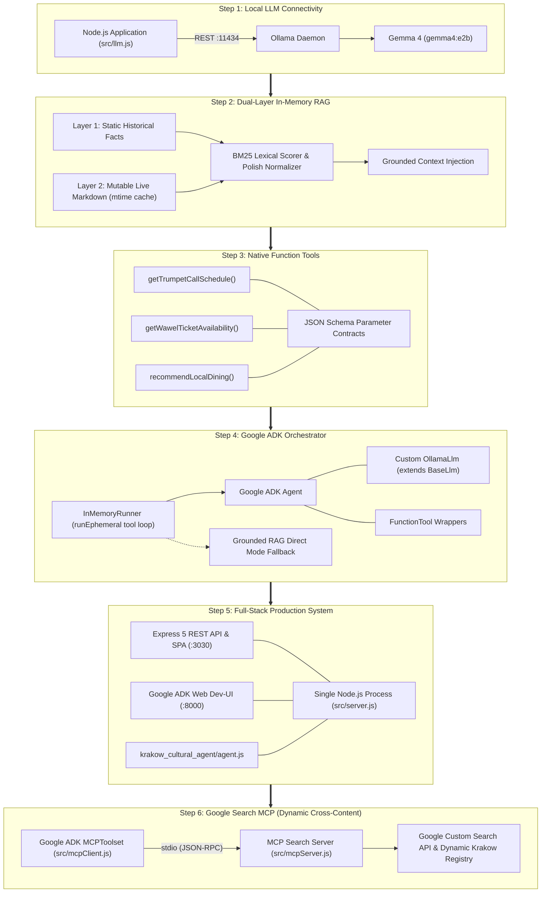
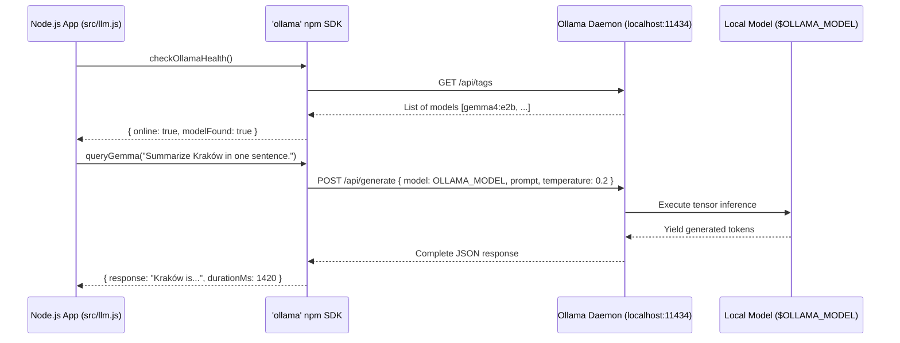
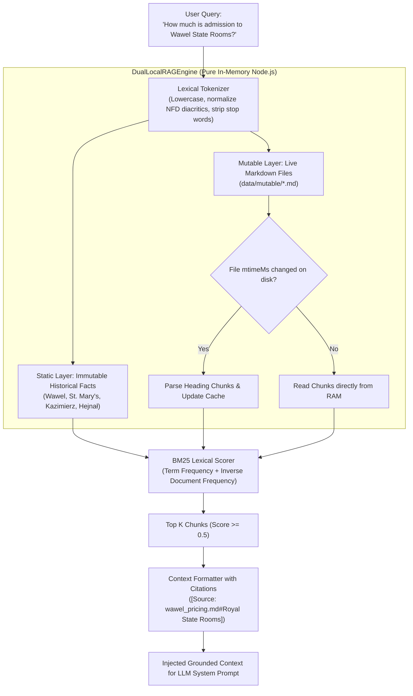
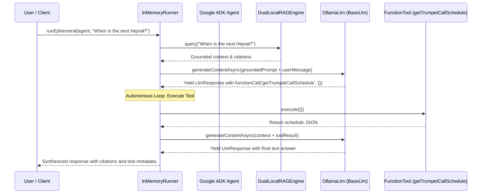

# Kraków Cultural AI Assistant: Complete 5-Step Hands-On Workshop Guide

> **Event:** DevFest Kraków 2026 | Google Developer Groups & Google Developer Experts  
> **Topic:** Building a Production-Grade, Local-First Cultural AI Assistant with Google ADK, Gemma 4, and In-Memory Dual-Layer RAG  
> **Runtime:** Node.js LTS (ESM) | Zero External Vector Database Dependencies | 100% On-Device  

---

## Workshop Overview & Executive Summary

Welcome to the **Google ADK & Gemma 4 Masterclass**! In this comprehensive hands-on workshop, developers build an enterprise-quality, privacy-preserving AI Tour Guide, Historian, and Concierge for the Royal Capital City of Kraków from scratch.

Modern AI agent tutorials often prescribe complex, multi-service architectures: cloud LLM APIs with unpredictable billing, heavyweight Python runtimes, external vector databases (Pinecone, Chroma, Milvus), embedding models competing for GPU memory, and slow multi-hop network round trips.

This workshop demonstrates a modern, high-performance alternative:
1. **Local-First Inference:** Run local models (such as Google's **Gemma 4** `gemma4:e2b`) via **Ollama**, configured dynamically via the `OLLAMA_MODEL` environment variable. This delivers sub-second response times with zero cloud API costs, complete privacy, and full offline resilience.
2. **In-Memory Dual-Layer RAG:** Eliminate external vector database bloat with a lightweight, native JavaScript lexical search engine that supports Polish diacritics, BM25 term scoring, and **zero-downtime hot-reloading** of markdown data via filesystem modification time (`mtime`) caching.
3. **Native Function Tools:** Bind asynchronous JavaScript domain tools (Hejnał Mariacki time math, Wawel Castle ticket inventory simulator, curated Kraków dining directory) declared with strict JSON Schema contracts.
4. **Google ADK Orchestration:** Implement official Google Agent Development Kit (`@google/adk`) patterns: custom `BaseLlm` streaming generator adapters, typed `FunctionTool` wrappers, prompt grounding, and autonomous multi-turn loops powered by `InMemoryRunner`.
5. **Unified Full-Stack Deployment:** Concurrently serve an Express 5 single-page application (port 3030) and the official Google ADK Web Dev-UI (`AdkApiServer` on port 8000) inside a single, unified Node.js process.
6. **Model Context Protocol (MCP) Dynamic Cross-Content:** Connect the Google ADK agent to a standalone Google Search MCP server over stdio to dynamically ground queries on live municipal events, seasonal festivals, temporary museum exhibitions, and live weather.

---

## Workshop Schedule & Pacing Guide

The workshop is designed for a **3-hour interactive masterclass** (with options for a compressed 2-hour format or an extended 4-hour hackathon track):

| Time Slot | Module | Format | Focus & Deliverable |
| :---: | :--- | :---: | :--- |
| **00:00 - 00:20** | **Welcome, Context & Architecture** | Presentation | The Local AI imperative, Google ADK ecosystem, Gemma 4 architecture, system overview. |
| **00:20 - 00:45** | **Step 01: Setup & Local LLM** | Hands-on Lab | Ollama daemon verification, pulling `gemma4:e2b`, Node.js ESM client, health checks, inference. |
| **00:45 - 01:25** | **Step 02: Dual-Layer RAG Engine** | Hands-on Lab | The "Database Overkill" breakdown, Polish diacritic tokenizer, BM25 scoring, live markdown hot-reload. |
| **01:25 - 01:40** | *Mid-Workshop Break & Coffee* | Break | Informal discussion, troubleshooting environment issues. |
| **01:40 - 02:05** | **Step 03: Native Tool Binding** | Hands-on Lab | JSON Schema tool contracts, Hejnał schedule math, Wawel ticketing simulator, dining filters. |
| **02:05 - 02:30** | **Step 04: Google ADK Orchestration** | Hands-on Lab | Deep dive into `@google/adk`, custom `OllamaLlm` (`BaseLlm`), `FunctionTool`, `InMemoryRunner` tool loops. |
| **02:30 - 02:45** | **Step 05: Full App & Dev-UI** | Hands-on & Demo | Unified Express SPA (port 3030) + Google ADK Web Dev-UI (port 8000), trace inspection. |
| **02:45 - 03:00** | **Step 06: Google Search MCP** | Hands-on Lab | Model Context Protocol (`@modelcontextprotocol/sdk`), `MCPToolset` over stdio, dynamic cross-content. |

---

## Workshop Roadmap & Checkpoint Navigation

The workshop repository is structured as a series of 6 self-contained, progressively evolved milestones. Each step folder contains its own working source code, automated test suite, and exhaustive documentation.

Participants can follow sequentially or jump directly to any step checkpoint if they fall behind or wish to explore a specific subsystem:

```
steps/
├── step-01-setup-and-llm/       # Step 1: Environment & Local LLM (5 tests)
├── step-02-dual-layer-rag/      # Step 2: Dual-Layer RAG Engine (9 tests)
├── step-03-native-tools/        # Step 3: Native Tool Binding & Execution (7 tests)
├── step-04-adk-agent/           # Step 4: Google ADK Orchestrator & Tool Loop (23 tests)
├── step-05-full-app/            # Step 5: Full Express SPA + ADK Dev-UI (35 tests)
└── step-06-google-search-mcp/   # Step 6: Google Search MCP & Dynamic Cross-Content (42 tests)
```

| Step | Milestone | Directory | Core Technologies | Automated Tests |
| :---: | :--- | :--- | :--- | :---: |
| **01** | **Setup & Local LLM** | [`steps/step-01-setup-and-llm/`](./steps/step-01-setup-and-llm/README.md) | Ollama, Gemma 4 (`gemma4:e2b`), Node.js ESM, `ollama` SDK | 5 tests |
| **02** | **Dual-Layer RAG Engine** | [`steps/step-02-dual-layer-rag/`](./steps/step-02-dual-layer-rag/README.md) | In-memory BM25, Polish diacritic normalization, heading chunking, `mtime` hot-reload | 9 tests |
| **03** | **Native Tool Binding** | [`steps/step-03-native-tools/`](./steps/step-03-native-tools/README.md) | JSON Schema parameters, Hejnał time math, Wawel ticket simulator, dining directory | 7 tests |
| **04** | **Google ADK Orchestration** | [`steps/step-04-adk-agent/`](./steps/step-04-adk-agent/README.md) | `@google/adk`, `BaseLlm`, `OllamaLlm`, `FunctionTool`, `InMemoryRunner`, offline fallback | 23 tests |
| **05** | **Full Application & UI** | [`steps/step-05-full-app/`](./steps/step-05-full-app/README.md) | Express 5 SPA (port 3030) + Google ADK Dev-UI (port 8000), pure ESM rootAgent | 35 tests |
| **06** | **Google Search MCP** | [`steps/step-06-google-search-mcp/`](./steps/step-06-google-search-mcp/README.md) | Model Context Protocol (`@modelcontextprotocol/sdk`), `MCPToolset` stdio, dynamic cross-content | 42 tests |
| **Total** | **All Steps Combined** | **Root Workspace** | **Complete Full-Stack Local AI Architecture** | **121 tests** |

---

## Architectural Evolution Across Steps



---

## System Prerequisites & Preparation

### 1. Hardware & Operating System
*   **Operating System:** Linux, macOS, or Windows (WSL2 recommended for Windows).
*   **Memory:** Minimum 8 GB RAM (16 GB recommended).
*   **VRAM:** ~1.8 GB VRAM if using GPU acceleration; CPU inference runs comfortably for `gemma4:e2b`.
*   **Disk Space:** ~4 GB free disk space for Node.js dependencies and Ollama model weights.

### 2. Required Software
Ensure the following tools are installed before the workshop:

1. **Node.js LTS (v20+ or v22+):**
   ```bash
   node -v
   # Should output v20.x or higher
   npm -v
   # Should output v10.x or higher
   ```

2. **Ollama:**
   Download and install from [ollama.com](https://ollama.com):
   ```bash
   # Linux / macOS install script:
   curl -fsSL https://ollama.com/install.sh | sh
   ```

3. **Local Instruction Model (Configurable via `OLLAMA_MODEL`):**
   Pre-pull the lightweight, high-performance instruction model (default `gemma4:e2b`):
   ```bash
   ollama pull gemma4:e2b
   ```
   Verify local model availability:
   ```bash
   ollama list
   # Should list your installed models (e.g. gemma4:e2b)
   ```

> [!IMPORTANT]
> **Conference WiFi Notice:** Workshop attendees should pull their target model (`gemma4:e2b`) before arriving at the venue to avoid bandwidth congestion on conference Wi-Fi networks.
>
> **Configuring the Active Model:**  
> The workshop application never hardcodes the model name. Set `OLLAMA_MODEL=gemma4:e2b` in your `.env` file or export it directly in your terminal.

---

## Root Quick Start & Global Verification

To install dependencies and run the complete test suite across all 6 steps in the root workspace:

```bash
# 1. Clone repository and install dependencies
git clone https://github.com/nuno-joao-andrade-dev/devfest-2026-krakow.git
cd devfest-2026-krakow
npm install

# 2. Run the automated test suite across all 6 steps (121 tests)
npm test

# 3. Launch the unified full application
npm start
```

Once running, access the services:
*   **Kraków Cultural Concierge Web App:** `http://localhost:3030`
*   **Google ADK Web Dev-UI:** `http://localhost:8000/dev-ui`

---

## Detailed Curriculum Breakdown (Step-by-Step)

---

### Step 01: Environment Setup & Local LLM Connectivity

*   **Location:** [`steps/step-01-setup-and-llm/`](./steps/step-01-setup-and-llm/README.md)
*   **Automated Tests:** 5 unit tests (`test/llm.test.js`)
*   **Key Source Files:** `src/llm.js`, `test/llm.test.js`, `.env.example`, `package.json`

#### 1. Conceptual Deep Dive
Why run LLMs locally rather than relying on commercial cloud APIs?
*   **Privacy & Data Sovereignty:** Prompts, municipal queries, and user itineraries never leave the device.
*   **Zero Operational Billing:** Eliminates per-token billing, subscriptions, and surprise API rate limits.
*   **Offline Resilience:** Kiosks, field devices, and tourist tablets continue operating without internet connectivity.
*   **Deterministic Latency:** Zero network hops, DNS lookups, or third-party queue delays.

#### 2. Architecture & Data Flow


#### 3. Hands-on Execution
```bash
cd steps/step-01-setup-and-llm
cp .env.example .env
npm start   # Runs the interactive verification script
npm test    # Runs the 5 unit tests
```

#### 4. Participant Exercises & Challenges
*   **Exercise 1.1 (Temperature Tuning):** Open `src/llm.js` and modify `options.temperature` from `0.2` to `0.9`. Re-run `npm start` several times and observe how the output variety changes compared to low-temperature deterministic mode.
*   **Exercise 1.2 (Offline Graceful Degradation):** Temporarily stop the Ollama daemon (`sudo systemctl stop ollama` or stop the desktop app) and run `npm start`. Notice how `checkOllamaHealth` returns `{ online: false }` without crashing the application process.
*   **Exercise 1.3 (Dynamic Model Switching via Environment Variables):** Without modifying code, switch your target model in `.env` to `OLLAMA_MODEL=qwen2.5:3b` (or pass `OLLAMA_MODEL=qwen2.5:3b npm start`). Verify that `checkOllamaHealth()` dynamically inspects and confirms the target model.

---

### Step 02: Dual-Layer In-Memory RAG Engine (Static & Mutable)

*   **Location:** [`steps/step-02-dual-layer-rag/`](./steps/step-02-dual-layer-rag/README.md)
*   **Automated Tests:** 9 unit tests (`test/ragEngine.test.js`)
*   **Key Source Files:** `src/ragEngine.js`, `data/mutable/*.md`, `test/ragEngine.test.js`

#### 1. Conceptual Deep Dive: Why Vector Databases are Overkill
In modern AI engineering, tutorials routinely push developers toward specialized Vector Databases (Pinecone, Chroma, Milvus, Qdrant) or relational vector extensions (`pgvector`). For localized, domain-specific AI applications, this is an architectural anti-pattern:
1. **Scale Mismatch:** Vector databases are designed for approximate nearest-neighbor search across millions of embeddings. Kraków's curated cultural knowledge comprises dozens to hundreds of paragraphs (< 2 MB of text).
2. **GPU VRAM Competition:** Hosting a local embedding model (e.g. `nomic-embed-text`) consumes 500 MB to 1.5 GB of GPU VRAM that should belong entirely to the generative model's KV cache.
3. **Double-Inference Latency:** Computing embedding vectors for every query adds 50ms-200ms latency. In-memory BM25 retrieval completes in **under 2 milliseconds**.
4. **Exact Entity Precision:** Lexical search avoids semantic drift. A query for "Dragon's Den ticket price in PLN" deterministically matches the exact pricing chunk rather than semantically similar but factually incorrect general history chunks.
5. **Zero-Downtime Hot Reloading:** Updating a markdown file in `data/mutable/` instantly reflects in memory on the next request using filesystem `mtimeMs` inspection without re-indexing pipelines or server restarts.

#### 2. Architecture & Data Flow


#### 3. Hands-on Execution
```bash
cd steps/step-02-dual-layer-rag
npm test    # Runs the 9 unit tests verifying tokenization, Polish diacritics, and hot-reload
```

#### 4. Interactive Live Hot-Reload Experiment
1. Open `data/mutable/wawel_pricing.md`.
2. Locate the Royal State Rooms pricing and change `35 PLN` to `55 PLN`.
3. Run `npm test` or query the engine. Notice how the cache invalidates and reflects the new price with zero downtime!

#### 5. Participant Exercises & Challenges
*   **Exercise 2.1 (Preserving Polish Characters):** Review the tokenization pipeline in `src/ragEngine.js`. Notice how `text.normalize('NFD').replace(/[\u0300-\u036f]/g, '')` handles Polish letters (`ą`, `ć`, `ę`, `ł`, `ń`, `ó`, `ś`, `ź`, `ż`). Test queries with and without diacritics (e.g. `krakow` vs `kraków`).
*   **Exercise 2.2 (Adding a New Mutable Document):** Create a new markdown file `data/mutable/festivals.md` documenting Kraków's Jewish Culture Festival and Wianki. Query the RAG engine and confirm the new knowledge is retrieved automatically.

---

### Step 03: Native Tool Binding & Execution

*   **Location:** [`steps/step-03-native-tools/`](./steps/step-03-native-tools/README.md)
*   **Automated Tests:** 7 unit tests (`test/tools.test.js`)
*   **Key Source Files:** `src/tools.js`, `test/tools.test.js`

#### 1. Conceptual Deep Dive: The LLM Tool Calling Interface
Language models cannot natively check system clocks, calculate exact real-time schedules, or access live ticket databases. The **Function Calling** contract bridges this gap:
1. The developer declares available tools using standard **JSON Schema** parameters.
2. The orchestrator shares these schemas with the LLM.
3. If user intent requires a tool, the LLM emits a structured JSON object (`functionCall: { name, args }`).
4. The host application executes the native JavaScript function and returns the result to the LLM to synthesize the final response.

#### 2. Domain Tools Detailed
1. **`getTrumpetCallSchedule()`**:
   *   Calculates exact minutes remaining until the next hourly performance of the *Hejnał Mariacki* from the 82-meter northern tower of St. Mary's Basilica.
   *   Returns the cardinal direction sequence: South (King / Wawel), West (Mayor / Town Hall), North (Guards / Florian Gate), East (Fire Brigade Chief).
   *   Provides historical context for the sudden musical cutoff honoring the 1241 trumpeter slain during the Mongol invasion.
2. **`getWawelTicketAvailability({ date })`**:
   *   Simulates real-time remaining inventory across 4 major exhibitions: *Royal State Rooms*, *Royal Private Apartments*, *Crown Treasury & Armoury*, and *Dragon's Den*.
   *   Handles omitted dates by defaulting to today, enforces Monday free-admission rules, and provides warnings for sold-out time slots.
3. **`recommendLocalDining({ district, budget })`**:
   *   Filters authentic dining venues across Kraków's historical districts: `Old Town`, `Kazimierz`, and `Podgórze`.
   *   Supports budget tiers: `budget` / `milk bar` (Bar Mleczny Górnik, Pod Temidą), `moderate` (Morskie Oko, Pod Aniołami), and `fine dining` (2-Michelin-starred Bottiglieria 1881).

#### 3. Hands-on Execution
```bash
cd steps/step-03-native-tools
npm test    # Runs the 7 unit tests verifying tool math, inventory simulation, and schema exports
```

#### 4. Participant Exercises & Challenges
*   **Exercise 3.1 (Date Parsing):** In `src/tools.js`, observe how `getWawelTicketAvailability` validates incoming dates (e.g., `YYYY-MM-DD`). Test queries with invalid dates and verify graceful fallback to the current date.
*   **Exercise 3.2 (Custom Tool Creation):** Create a fourth tool `getVistulaRiverCruiseSchedule()` that returns seasonal operating hours and pier locations along the Vistula river. Export its JSON schema and register it in `toolsByName`.

---

### Step 04: Google ADK Orchestration & Autonomous Tool Loop

*   **Location:** [`steps/step-04-adk-agent/`](./steps/step-04-adk-agent/README.md)
*   **Automated Tests:** 23 tests across 3 suites (`test/**/*.test.js`)
*   **Key Source Files:** `src/agent.js`, `src/ragEngine.js`, `src/tools.js`, `test/agent.test.js`

#### 1. Conceptual Deep Dive: Google ADK Architecture
The **Google Agent Development Kit (`@google/adk`)** provides a modular, production-tested foundation for building enterprise AI agents in Node.js.

Key core abstractions:
*   **`Agent`:** High-level container defining the agent's identity, system prompt instruction, model instance, and tool bindings.
*   **`BaseLlm`:** Abstract class for LLM engines. We implement `OllamaLlm` to adapt Ollama's HTTP streaming chat protocol to ADK's `async *generateContentAsync(llmRequest)` generator contract.
*   **`FunctionTool`:** Wraps native JavaScript functions into typed ADK tool instances with schema validation.
*   **`InMemoryRunner`:** Orchestrates the multi-turn conversational loop (`runEphemeral`). When the model requests a tool call, `InMemoryRunner` halts generation, invokes `FunctionTool.execute(args)`, injects the result into the conversation context, and re-invokes the model for final synthesis.

#### 2. Autonomous Tool Loop Sequence


#### 3. Hands-on Execution
```bash
cd steps/step-04-adk-agent
cp .env.example .env
npm test    # Runs 23 unit tests verifying ADK components, tool dispatching, and fallback modes
```

#### 4. Resilient Fallback Mode (Air-Gapped Offline Protection)
`src/agent.js` includes an offline fallback engine:
*   If the local Ollama daemon is unreachable or starting up, the agent switches to **Grounded RAG Direct Mode**.
*   The fallback engine parses user intent, executes any necessary tools directly, retrieves matching RAG knowledge chunks, and formats a factual answer with source citations.
*   Ensures 100% uptime for museum kiosks and visitor terminals even during daemon restarts.

---

### Step 05: Full Application with Express & Google ADK Dev-UI

*   **Location:** [`steps/step-05-full-app/`](./steps/step-05-full-app/README.md)
*   **Automated Tests:** 35 tests across 4 suites (`test/**/*.test.js`)
*   **Key Source Files:** `src/server.js`, `src/agent.js`, `src/ragEngine.js`, `src/tools.js`, `public/index.html`, `krakow_cultural_agent/agent.js`

#### 1. Conceptual Deep Dive: Unified Production Runtime
In production deployments, AI agents require both end-user interfaces and developer observability tools. Step 5 combines both within a **single Node.js process** (`src/server.js`):
1. **Port 3030 (Express 5 REST API & SPA):**
   *   Serves responsive, accessible vanilla HTML5/CSS3 single-page chat application (`public/index.html`).
   *   Zero frontend build toolchain overhead: no Vite, Webpack, or TypeScript compilation required.
   *   REST endpoints: `POST /api/chat`, `GET /api/health`, `GET /api/tools`, `POST /api/tools/:toolName`, `GET /api/rag/stats`.
   *   Redirect route: `GET /dev-ui` redirects directly to `http://localhost:8000/dev-ui`.
2. **Port 8000 (Google ADK Web Dev-UI):**
   *   Runs official `@google/adk-devtools` (`AdkApiServer`) concurrently.
   *   Enables live graph visualization of agent components, state inspection, and step-by-step trace debugging of tool calls and model responses.
3. **Pure ESM Root Agent Export:**
   *   `krakow_cultural_agent/agent.js` exports `rootAgent` for native Google ADK CLI tooling (`npx adk web`).

#### 2. Complete REST API Reference
| Endpoint | Method | Purpose | Sample Request / Query | Sample Response |
| :--- | :---: | :--- | :--- | :--- |
| `/api/chat` | `POST` | Send conversation turn | `{"message": "When is the next Hejnał?"}` | `{"success": true, "response": "...", "sources": [...], "toolsUsed": [...]}` |
| `/api/health` | `GET` | Health & telemetry check | None | `{"status": "healthy", "ollama": {"online": true}, "rag": {"totalChunks": 15}}` |
| `/api/tools` | `GET` | Enumerate tool schemas | None | `{"tools": [{"type": "function", "function": {...}}]}` |
| `/api/tools/:name` | `POST` | Direct tool invocation | `POST /api/tools/getTrumpetCallSchedule` | `{"success": true, "eventName": "Hejnał Mariacki", ...}` |
| `/api/rag/stats` | `GET` | Inspect RAG chunk counts | None | `{"staticChunks": 9, "mutableChunks": 6, "total": 15}` |
| `/dev-ui` | `GET` | Dev-UI redirect | None | HTTP 302 Redirect to `http://localhost:8000/dev-ui` |

#### 3. Hands-on Execution
```bash
cd steps/step-05-full-app
cp .env.example .env

# Launch the unified server
npm start

# Run all 35 unit and integration tests
npm test
```

#### 4. Interactive Browser Exploration
1. Open `http://localhost:3030` to test the tour guide chat interface.
2. Click the quick-prompt pills:
   *   *"What is the schedule and history of the Hejnał Mariacki trumpet call?"*
   *   *"Check Wawel Castle ticket availability for tomorrow."*
   *   *"What are the official ticket prices and opening hours for Wawel Castle?"*
   *   *"Recommend an authentic milk bar in Old Town."*
3. Notice the display of tool execution badges, source attribution citations, and duration telemetry.
4. Click the **ADK Dev-UI (Port 8000)** header badge or navigate to `http://localhost:8000/dev-ui` to inspect agent traces, graphs, and tool parameters.

---

### Step 06: Google Search MCP & Dynamic Cross-Content

*   **Location:** [`steps/step-06-google-search-mcp/`](./steps/step-06-google-search-mcp/README.md)
*   **Automated Tests:** 42 tests across 6 suites (`test/**/*.test.js`)
*   **Key Source Files:** `src/mcpServer.js`, `src/mcpClient.js`, `src/agent.js`, `src/server.js`, `public/index.html`

#### 1. Conceptual Deep Dive: Overcoming the "Closed-World" Assumption
In local-first AI architectures, the agent's knowledge boundary is strictly limited to what has been pre-indexed into the RAG corpus or encoded into native tool logic. When users ask questions about external or rapidly shifting real-world events—such as annual summer festivals in Kazimierz, temporary art loans (e.g., Leonardo da Vinci's *Lady with an Ermine*), or Kraków airport rail transit—the local model risks hallucinating or admitting defeat.

**The Solution:** The **Model Context Protocol (MCP)**.
*   Initiated as an open standard by Anthropic and adopted across the AI industry (including Google ADK, Claude, and Antigravity), MCP standardizes how AI applications discover and invoke tools over standard I/O (stdio) or HTTP/SSE transports.
*   Unlike proprietary model-bound search grounding tools (which only work with specific cloud APIs), an **MCP Search Server** can be consumed by *any* LLM engine—including on-device Gemma 4 via Ollama.

#### 2. The Tri-Layer Knowledge Architecture
```
┌────────────────────────────────────────────────────────┐
│               Visitor Query / Chat Turn                │
└──────────────────────────┬─────────────────────────────┘
                           │
             ┌─────────────┴─────────────┐
             ▼                           ▼
   [Local Knowledge Check]       [External Search Needed?]
             │                           │
    ┌────────┴────────┐                  │
    ▼                 ▼                  ▼
[Layer 1: Static]  [Layer 2: Mutable] [Layer 3: Dynamic MCP]
Historical Corpus  Live Markdown       Google Search MCP Server
(Wawel, Basilica,  (wawel_pricing.md,  (Festivals, Exhibitions,
 Kazimierz, 0ms)    services, <2ms)     Live Weather, Transit)
```

#### 3. MCP Server Implementation (`src/mcpServer.js`)
Built with `@modelcontextprotocol/sdk`, the server registers two primary tools:
1. `google_search`: Executes real-time Google Custom Search (if `GOOGLE_SEARCH_API_KEY` and `GOOGLE_SEARCH_CX` are provided) or provides rich, curated dynamic cross-content for Kraków (festivals, temporary exhibitions, live weather, commuter rail).
2. `get_krakow_events_calendar`: Returns structured seasonal cultural events filtered by category (`film`, `festivals`, `music`, `art`, `tradition`).

#### 4. Connecting Google ADK to MCP (`src/agent.js`)
Google ADK's `MCPToolset` makes stdio tool connection seamless:
```javascript
import { MCPToolset } from '@google/adk';

// 1. Initialize MCP connection over stdio
const mcpToolset = new MCPToolset({
  type: 'StdioConnectionParams',
  serverParams: {
    command: 'node',
    args: ['./src/mcpServer.js']
  }
});

// 2. Discover MCP tools asynchronously
const mcpTools = await mcpToolset.getTools();

// 3. Bind native tools and MCP tools into a unified ADK Agent
const agent = new Agent({
  name: 'krakow_cultural_mcp_agent',
  model: ollamaLlm,
  instruction: groundedSystemPrompt,
  tools: [...nativeFunctionTools, ...mcpTools]
});
```

#### 5. Hands-on Execution
```bash
cd steps/step-06-google-search-mcp
cp .env.example .env

# Launch unified server on port 3030 and ADK Dev-UI on port 8000
npm start

# Run comprehensive test suite (42 unit and integration tests)
npm test
```

#### 6. Dynamic Queries to Try in the UI (`http://localhost:3030`)
*   *"When is the Jewish Culture Festival in Kazimierz?"* (Triggers MCP `google_search` or `get_krakow_events_calendar`)
*   *"Where can I see Leonardo da Vinci's Lady with an Ermine?"* (Retrieves Czartoryski Museum details via MCP)
*   *"What is the fastest way to get from Kraków Airport to Old Town?"* (Retrieves SKA1 Balice rail details)
*   *"What festivals are on the Kraków cultural calendar this summer?"* (Returns multi-event seasonal schedule)

---

## Comprehensive Instructor Guide

### 1. Pre-Workshop Preparation Checklist
*   [ ] **Model Cache USB Sticks:** Conference Wi-Fi is frequently slow or congested. Prepare 2-3 USB flash drives containing pre-downloaded Ollama binaries and the `~/.ollama/models` cache containing `gemma4:e2b` for rapid offline copying.
*   [ ] **Port Collision Checks:** Verify that ports `3030`, `8000`, and `11434` are not occupied by existing local services (e.g. other Node apps, local proxy servers).
*   [ ] **Node.js LTS Verification:** Ensure attendees run Node.js 20.x or 22.x LTS. Older Node versions (< 18.x) lack native ESM flag support and the built-in test runner (`node:test`).

### 2. Time Management & Pacing Strategy
*   **Adhere to Step Checkpoints:** If a student encounters a syntax or environment issue during Step 2, encourage them to navigate directly to `steps/step-03-native-tools/` rather than spending 20 minutes debugging.
*   **Focus on Concepts Before Code:** Spend 5 minutes explaining *why* before diving into code (e.g., explain the vector DB overkill argument before inspecting BM25 tokenization).
*   **Interactive Demonstrations:** Project your screen and demonstrate the live hot-reload in Step 2: edit `wawel_pricing.md`, save, and query immediately to show attendees the power of filesystem-based cache invalidation.

### 3. Common Troubleshooting FAQ
| Symptom / Error | Root Cause | Immediate Remediation |
| :--- | :--- | :--- |
| `ECONNREFUSED 127.0.0.1:11434` | Ollama daemon is not running in background. | Run `ollama serve` in a dedicated terminal window. |
| `model '<name>' not found` | The configured model weights were not pulled. | Run `ollama pull <name>` (e.g. `ollama pull gemma4:e2b`) or update `OLLAMA_MODEL` in `.env`. |
| `EADDRINUSE: address already in use :::3030` | Another process is holding port 3030. | Identify and kill the process: `lsof -ti:3030 \| xargs kill -9` or change `PORT` in `.env`. |
| `EADDRINUSE: address already in use :::8000` | Another process is holding port 8000. | Change `ADK_PORT=8001` in `.env`. |
| Out of Memory (OOM) during inference | High background memory usage on host. | Switch to a lighter model or quantization, or close memory-heavy apps. |

---

## Slide Deck Reference

A companion Google Developer Experts (GDE) presentation slide deck is provided:
*   **Markdown Deck (Marp-compatible):** [`SLIDES.md`](./SLIDES.md)
*   **Rendered HTML Presentation:** [`slides.html`](./slides.html)
*   **Printable PDF Document:** [`slides.pdf`](./slides.pdf)
*   **Compile / View Commands:**
    ```bash
    # Open the standalone HTML presentation directly:
    open slides.html    # macOS
    xdg-open slides.html # Linux
    
    # Or build HTML / PDF with Marp:
    npm run slides:build
    npm run slides:pdf
    npm run slides:watch
    npm run slides:serve
    ```

---

## License & Credits

Developed by the **Google Developer Groups (GDG) & Google Developer Experts (GDE)** community for **DevFest Kraków 2026**.

Licensed under the **Apache-2.0 License**.
