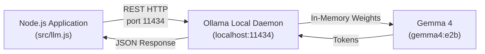

# Workshop Step 01: Environment Setup & Local LLM Connectivity

> **Objective:** Set up the Node.js development environment, establish communication with the local Ollama daemon, and run on-device inference using the lightweight **Gemma 4** (`gemma4:e2b`) instruction model.

---

## Learning Objectives

By completing this step, you will:
1. Understand the architecture of local on-device inference vs. cloud-hosted APIs.
2. Configure local LLM parameters (host binding, temperature, streaming).
3. Connect Node.js to Ollama via the official `ollama` SDK.
4. Verify daemon health, inspect installed models, and execute single-turn inference.

---

## Architecture & Data Flow



---

## Prerequisites

Before starting this step, verify that you have:
1. **Node.js LTS** (v20+ or v22+): Check with `node -v`
2. **Ollama CLI** installed on your machine: Check with `ollama --version`
3. The local instruction model pulled via Ollama (configured via `OLLAMA_MODEL`, default `gemma4:e2b`):
   ```bash
   # Pull default model
   ollama pull gemma4:e2b
   ```
   *(The model is entirely configurable via the `OLLAMA_MODEL` environment variable!)*

---

## Hands-on Instructions

### 1. Navigate to the Step Directory

If you are working from this checkpoint:
```bash
cd steps/step-01-setup-and-llm
```

### 2. Configure Environment Variables

Copy `.env.example` to `.env`:
```bash
cp .env.example .env
```

Default contents of `.env`:
```env
OLLAMA_HOST=http://127.0.0.1:11434
# Local model to use (e.g. gemma4:e2b)
OLLAMA_MODEL=gemma4:e2b
```

> **Configuring the Model via Environment Variables:**  
> The model name is **not hardcoded**. It is loaded dynamically via `process.env.OLLAMA_MODEL` (or `process.env.MODEL`), defaulting to `gemma4:e2b`. You can test different local models (e.g. `qwen2.5:3b`) without modifying source code by updating `.env` or setting the variable directly in your shell:
> ```bash
> export OLLAMA_MODEL=gemma4:e2b
> npm start
> ```

### 3. Run the Standalone Verification Script

Execute the standalone check script:
```bash
npm start
```

**Expected Console Output:**
```text
Checking local Ollama connectivity at: http://127.0.0.1:11434
Target Model: gemma4:e2b
Ollama daemon is ONLINE.
Available models: gemma4:e2b, ...
Model "gemma4:e2b" is ready locally!

Sending test query to Gemma 4: "Summarize Kraków in one short sentence."

Gemma 4 Response:
Kraków is a historic Polish city renowned for its preserved medieval Old Town, royal Wawel Castle, and vibrant cultural heritage.
Duration: 1420ms
```

### 4. Run the Automated Unit Tests

Run the test suite using Node's native test runner:
```bash
npm test
```

---

## Code Walkthrough (`src/llm.js`)

Let's examine how [`src/llm.js`](file:///home/nandrade/projects/nja.dev/devfest_krakow_2026/steps/step-01-setup-and-llm/src/llm.js) interacts with Ollama:

### 1. Environment Variables & Dynamic Model Configuration
```javascript
export const OLLAMA_HOST = process.env.OLLAMA_HOST || 'http://127.0.0.1:11434';
export const OLLAMA_MODEL = process.env.OLLAMA_MODEL || process.env.MODEL || 'gemma4:e2b';
```
*   The model identifier is **never hardcoded** in business logic.
*   Priority order: `process.env.OLLAMA_MODEL` → `process.env.MODEL` → `'gemma4:e2b'`.
*   Developers can seamlessly swap between models (`gemma4:e2b`, `qwen2.5:3b`, etc.) without altering code.

### 2. Creating the Ollama Client
```javascript
import { Ollama } from 'ollama';

export function createOllamaClient(host = OLLAMA_HOST) {
  return new Ollama({ host });
}
```
*   `Ollama` connects to the local daemon socket (default `http://127.0.0.1:11434`).
*   No API keys are required since the model runs 100% on your machine.

### 3. Daemon Health & Model Discovery
```javascript
export async function checkOllamaHealth(client = createOllamaClient(), targetModel = OLLAMA_MODEL) {
  try {
    const listResponse = await client.list();
    const modelNames = listResponse?.models?.map(m => m.name) || [];
    const modelFound = modelNames.some(name => name === targetModel || name.startsWith(targetModel.split(':')[0]));
    return { online: true, models: modelNames, modelFound };
  } catch (error) {
    return { online: false, models: [], modelFound: false, error: error.message };
  }
}
```
*   Calls `/api/tags` on Ollama to inspect all installed models.
*   Guarantees graceful degradation if the Ollama daemon is offline or restarting.

### 4. Performing Inference
```javascript
export async function queryGemma(prompt, options = {}) {
  const client = options.client || createOllamaClient();
  const model = options.model || OLLAMA_MODEL;

  const res = await client.generate({
    model,
    prompt,
    stream: false,
    options: {
      temperature: 0.2 // Low temperature for high factual consistency
    }
  });

  return {
    response: res.response.trim(),
    durationMs: Date.now() - start
  };
}
```
*   `temperature: 0.2`: We set a lower temperature to encourage grounded, repeatable responses rather than high randomness, which is vital for historical facts and ticketing data.

---

## Common Pitfalls & Troubleshooting

| Issue | Cause | Solution |
| :--- | :--- | :--- |
| `ECONNREFUSED 127.0.0.1:11434` | The Ollama daemon is not running | Run `ollama serve` in a background terminal. |
| `model '<name>' not found` | The model weights are not downloaded | Run `ollama pull <name>` (e.g. `ollama pull gemma4:e2b`), or set `OLLAMA_MODEL` to an installed model. |
| Out of Memory (OOM) | System RAM/VRAM is exhausted | Close memory-heavy applications or switch to a lighter model in `.env`. |

---

## Ready for the Next Step?

Now that our local LLM is functioning properly, our next challenge is providing factual knowledge to prevent hallucinations about Kraków's history, prices, and regulations!

Proceed to **[Step 02: Dual-Layer RAG Engine (Static & Mutable)](../step-02-dual-layer-rag/README.md)**!
