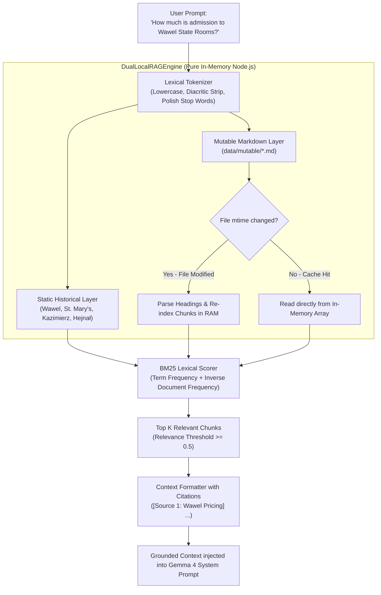

# Workshop Step 02: Dual-Layer RAG Engine (Static & Mutable)

> **Objective:** Build a zero-dependency, in-memory **Dual-Layer Retrieval-Augmented Generation (RAG)** engine in pure JavaScript. Ground LLM responses in verified Kraków historical facts and live, hot-reloading markdown documents without external vector or relational databases.

---

## Learning Objectives

By completing this step, you will:
1. Deeply understand the engineering tradeoffs of vector databases versus in-memory lexical retrieval, and why database infrastructure is often an anti-pattern or unnecessary overkill for domain-specific local AI assistants.
2. Build a fast, lightweight lexical search engine from scratch using tokenization, Unicode Polish diacritic preservation, stop-word removal, and BM25 term weighting.
3. Implement a **Dual-Layer Knowledge Base**:
   - **Layer 1: Static Historical Corpus** (immutable facts: Wawel Castle, St. Mary's, Kazimierz, Hejnał).
   - **Layer 2: Mutable Dynamic Layer** (frequently changing facts: ticket prices, opening hours, emergency hotlines in `data/mutable/*.md`).
4. Implement filesystem timestamp (`mtime`) caching for **zero-downtime hot reloading** of live data without restart or re-indexing pipelines.

---

## Architectural Deep Dive: Why Using a Database is Overkill

In modern enterprise AI tutorials, developers are frequently told that building any RAG system mandates spinning up a specialized Vector Database (such as Pinecone, Chroma, Milvus, Weaviate, or Qdrant) or an enterprise relational/document store (PostgreSQL with `pgvector`, MongoDB Atlas, etc.).

For our local Kraków Cultural Assistant (and indeed for the vast majority of localized, domain-specific AI agents), adding a database is not just unnecessary—**it is an engineering anti-pattern that introduces severe operational liabilities**.

Here is the concrete architectural breakdown of why:

### 1. The Scale Mismatch: Micro-Corpus vs. Distributed Infrastructure
*   **Vector DB Design Space:** Vector databases were invented to solve high-dimensional nearest-neighbor search (Approximate Nearest Neighbors via HNSW or IVF-PQ graphs) over millions or billions of multi-gigabyte vector embeddings.
*   **Our Domain Reality:** Kraków's cultural heritage, museum opening hours, ticketing structures, and emergency services represent a few dozen to a few hundred curated document sections. Even a comprehensive city guide with hundreds of landmarks and menus occupies less than 2 to 5 megabytes of raw text.
*   **The Overkill Factor:** Running a distributed database engine, listening on separate network ports, allocating hundreds of megabytes of RAM, and managing persistence engines simply to index 50 to 500 paragraphs is extreme architectural bloat.

### 2. Eliminating the "Double Inference" Latency & VRAM Tax
Traditional vector search requires computing high-dimensional floating-point embeddings (e.g., 768 or 1536 floating-point values) for every incoming user prompt before retrieval can even begin:
*   **GPU VRAM Competition:** If running locally, you must host an embedding model (like `nomic-embed-text` or `all-minilm`) in memory alongside our primary generative LLM (e.g. `gemma4:e2b` configured via `OLLAMA_MODEL`). On constrained hardware (edge devices, laptops, tourist kiosks), this consumes 500MB to 1.5GB of precious GPU VRAM that should belong entirely to the generative model's KV cache and context window.
*   **Latency Penalty:** Calculating the query vector embedding locally adds 50ms to 200ms of pure latency to every request. If done via an external embedding API, you incur round-trip HTTP overhead, DNS lookups, authentication handshakes, and third-party rate limits.
*   **The In-Memory Lexical Alternative:** Our in-memory lexical tokenizer and BM25 scorer operate directly on raw string tokens in CPU memory. Retrieval over hundreds of chunks takes **under 2 milliseconds**—an order of magnitude faster than generating a single embedding vector.

### 3. Exact Precision vs. Semantic Drift and False Positives
Vector similarity (cosine distance over dense embeddings) measures broad thematic relatedness, but often struggles with exact domain entities, codes, currencies, and numbers:
*   **The Semantic Drift Problem:** If a user asks *"What is the admission price for the Dragon's Den in PLN?"*, a dense embedding vector often exhibits high similarity scores to general Wawel history, the legend of Skuba the cobbler, or the Royal Apartments because they all share the general semantic cluster of "Wawel" and "Castle". The exact pricing table chunk might be ranked 4th or 5th, missing the retrieval top-k cutoff.
*   **Lexical Determinism:** Lexical BM25 search with term frequency and inverse document frequency rewards exact keyword occurrences: `Dragon's Den`, `PLN`, `admission`, `price`. The exact pricing chunk is guaranteed a top score because it contains those exact discriminative terms, completely eliminating semantic drift.

### 4. Zero-Downtime Hot Reloading Without Ingestion Pipelines
When ticket prices change or museum hours shift for a national holiday:
*   **With a Database / Vector DB:** You must write an ingestion worker script, split the text, run it through the embedding model to generate new vectors, execute an upsert transaction, handle connection retries, and trigger cache invalidation in your application layer.
*   **With Our In-Memory `mtime` Watcher:** Museum staff or tour concierges simply open `data/mutable/wawel_pricing.md` in any text editor or CMS, update the number, and hit Save. The next incoming HTTP request inspects `fs.statSync(file).mtimeMs`, detects the timestamp change in 0.05ms, re-parses the markdown headings, and updates the in-memory cache instantly. Zero downtime, zero re-embedding costs, zero database migrations.

### 5. Deployment Simplicity and Zero Operational Moving Parts
*   **External Service Failure Modes:** Every external database is a point of operational failure requiring Docker Compose definitions, health checks, connection pool sizing, authentication credentials, volume mount backups, and network debugging.
*   **Pure Zero-Dependency Node.js:** By keeping the RAG engine in native JavaScript, our entire application runs anywhere Node.js runs—whether on a developer laptop, an offline museum kiosk, an edge Raspberry Pi, or a serverless container—with zero external services to install, configure, or monitor.

---

## Architectural Comparison Matrix

| Architectural Dimension | Traditional Vector Database (Pinecone / Chroma / Milvus) | Traditional Relational / NoSQL (Postgres / Mongo) | Our Dual-Layer In-Memory RAG Engine |
| :--- | :--- | :--- | :--- |
| **External Dependencies** | High (Docker, daemon, API tokens, network ports) | Medium to High (DB server, connection pools, ORM) | **Zero (100% native Node.js standard library)** |
| **Query Latency** | 30ms - 250ms (embedding generation + network hop) | 10ms - 50ms (SQL parsing, query planner, IPC) | **< 2ms (direct RAM array/map traversal)** |
| **VRAM & Hardware Footprint** | Additional 500MB - 2GB VRAM for embedding model | 200MB - 1GB RAM for DB buffer pools and daemons | **< 5MB RAM for in-memory document corpus** |
| **Operational Points of Failure**| High (daemon crashes, vector index corruption) | Medium (connection leaks, migrations, auth) | **None (contained within application lifecycle)** |
| **Exact Term & Price Matching** | Unreliable (prone to semantic drift and fuzzy noise) | Reliable (requires explicit SQL LIKE or fulltext index) | **Deterministic (BM25 term scoring on exact tokens)** |
| **Hot Reload Mechanism** | Complex ETL (re-chunk, re-embed, upsert, re-index) | Database write transactions and cache invalidation | **Instant filesystem `mtime` timestamp detection** |
| **Offline Capability** | Complex (requires local embedding engine) | Good (if running local daemon) | **100% offline and fully air-gapped** |

---

## Architecture & Mental Model



---

## Directory Structure for Step 2

```
steps/step-02-dual-layer-rag/
├── README.md                  # This detailed guide and rationale
├── package.json               # Node test scripts and metadata
├── data/
│   └── mutable/
│       ├── wawel_pricing.md   # Live museum ticket prices and opening hours
│       └── tourist_services.md# Emergency dispatch lines, InfoKraków visitor centers
├── src/
│   └── ragEngine.js           # Complete zero-dependency dual-layer RAG engine
└── test/
    └── ragEngine.test.js      # Comprehensive automated unit tests (9 tests)
```

---

## Hands-on Instructions

### 1. Navigate to the Step Directory

```bash
cd steps/step-02-dual-layer-rag
```

### 2. Run the Unit Tests

Execute the automated test suite using Node's native test runner:
```bash
npm test
```

**Expected Console Output:**
```text
DualLocalRAGEngine Unit Tests
  [PASS] tokenizes text and strips stop words correctly (1.5ms)
  [PASS] preserves Polish diacritics and letters during tokenization (0.5ms)
  [PASS] handles empty or non-string input safely in tokenize (0.7ms)
  [PASS] parses markdown headings into structured chunks (0.5ms)
  [PASS] initializes RAG engine and loads static knowledge (1.7ms)
  [PASS] retrieves relevant static historical content for Wawel dragon query (4.6ms)
  [PASS] retrieves relevant mutable content for Wawel pricing inquiry (2.4ms)
  [PASS] formats prompt context with accurate source attribution (3.3ms)
  [PASS] hot-reloads dynamically when a new mutable file is written (6.4ms)
[PASS] DualLocalRAGEngine Unit Tests (23.4ms)
INFO: tests 9
INFO: suites 1
INFO: pass 9
INFO: fail 0
```

### 3. Interactive Experiment: Test Live Hot-Reloading

Try editing [`data/mutable/wawel_pricing.md`](file:///home/nandrade/projects/nja.dev/devfest_krakow_2026/steps/step-02-dual-layer-rag/data/mutable/wawel_pricing.md) in your editor (e.g. change an admission price from 35 PLN to 50 PLN, or add a new festival section). When `engine.query(...)` is called, the engine detects the file's changed `mtime`, invalidates the stale cache, and re-indexes the new markdown chunks automatically without restarting the process!

---

## Deep Code Walkthrough (`src/ragEngine.js`)

### 1. Tokenization & Polish Diacritic Normalization
```javascript
export function tokenize(text) {
  if (!text || typeof text !== 'string') return [];
  return text
    .toLowerCase()
    .normalize('NFD') // Decomposes accented characters into base letters + diacritic marks
    .replace(/[\u0300-\u036f]/g, '') // Strips accents (ą -> a, ć -> c, ł -> l, ż -> z)
    .replace(/[^\w\s]/g, ' ')
    .split(/\s+/)
    .filter(token => token.length > 2 && !STOP_WORDS.has(token));
}
```
*   Removes common English and Polish stop words (`the`, `is`, `at`, `i`, `w`, `na`).
*   Normalizes accented characters so queries match regardless of Polish keyboard layouts or user spelling variations.

### 2. Semantic Markdown Heading Chunking
```javascript
export function chunkMarkdown(content, filename) {
  const lines = content.split('\n');
  const chunks = [];
  let currentHeading = path.basename(filename, '.md');
  let currentSection = [];
  
  for (const line of lines) {
    if (line.startsWith('#')) {
      if (currentSection.length > 0) {
        chunks.push({
          source: `${filename}#${currentHeading}`,
          content: currentSection.join('\n').trim()
        });
        currentSection = [];
      }
      currentHeading = line.replace(/^#+\s*/, '').trim();
    } else {
      currentSection.push(line);
    }
  }
  // Flush final section
  if (currentSection.length > 0) {
    chunks.push({
      source: `${filename}#${currentHeading}`,
      content: currentSection.join('\n').trim()
    });
  }
  return chunks;
}
```
*   Unlike arbitrary fixed-length character splitting (which cuts sentences and tables in half), markdown heading chunking preserves complete conceptual sections (e.g., `# Royal Crypts Admission` remains one coherent context block).

### 3. File Timestamp-Based Dynamic Invalidation (`mtime`)
```javascript
loadMutableDocuments() {
  const files = fs.readdirSync(this.mutableDir);
  for (const file of files) {
    const filePath = path.join(this.mutableDir, file);
    const stats = fs.statSync(filePath);
    
    // Check if cached and file has not been modified on disk
    if (this.cache[file] && this.cache[file].mtime === stats.mtimeMs) {
      chunks.push(...this.cache[file].chunks);
      continue;
    }
    
    // Re-index only if file was modified on disk!
    const content = fs.readFileSync(filePath, 'utf8');
    const freshChunks = chunkMarkdown(content, file);
    this.cache[file] = { mtime: stats.mtimeMs, chunks: freshChunks };
    chunks.push(...freshChunks);
  }
}
```
*   Guarantees sub-millisecond retrieval on cache hits while enabling zero-downtime content updates by museum curators or tour staff.

---

## Ready for the Next Step?

Now that our agent can retrieve factual knowledge with zero database dependencies, it needs the ability to take action in the physical world: calculate the exact minute of the next trumpet call, check live ticket availability, and filter local dining!

Proceed to **[Step 03: Native Tool Binding & Execution](../step-03-native-tools/README.md)**!
