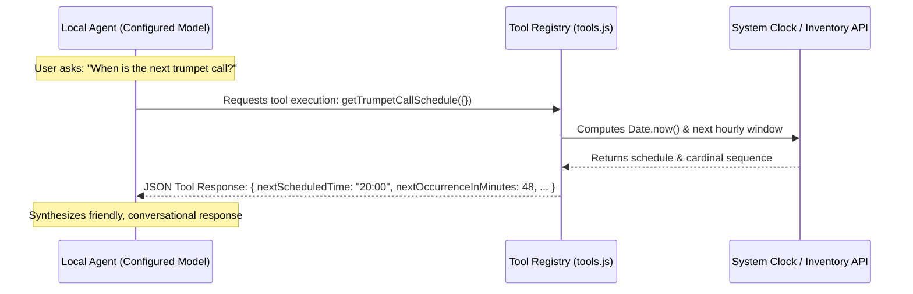

# Workshop Step 03: Native Tool Binding & Execution

> **Objective:** Define and implement native asynchronous JavaScript domain tools with strict **JSON Schema declarations**. Enable the AI agent to compute live schedules, query simulated ticketing inventory, and recommend local dining in Kraków.

---

## Learning Objectives

By completing this step, you will:
1. Understand the **Function Calling / Tool Calling** interface used by modern LLMs (Gemini, Gemma, GPT-4).
2. Author standard JSON Schema parameter specifications that declare names, types, descriptions, enums, and required fields.
3. Implement 3 domain-specific tools:
   - **`getTrumpetCallSchedule`**: Real-time minute calculation until the next hourly *Hejnał Mariacki* with historical direction mapping.
   - **`getWawelTicketAvailability`**: Simulated live museum ticketing inventory system.
   - **`recommendLocalDining`**: Multi-district culinary guide (Old Town, Kazimierz, Podgórze) filtered by budget tier.
4. Test tool execution directly and independently of the LLM.

---

## Architecture & Function Calling Contract



---

## Directory Structure for Step 3

```
steps/step-03-native-tools/
├── README.md             # This detailed guide
├── package.json          # Node test scripts
├── src/
│   └── tools.js          # Tool declarations, registry, and async implementations
└── test/
    └── tools.test.js     # Unit tests verifying parameters, calculations, and output schemas
```

---

## Hands-on Instructions

### 1. Navigate to the Step Directory

```bash
cd steps/step-03-native-tools
```

### 2. Run the Unit Tests

Execute the automated test suite:
```bash
npm test
```

**Expected Console Output:**
```text
Native Agent Tools Unit Tests
  [PASS] getTrumpetCallSchedule returns accurate schedule and four directions (3.1ms)
  [PASS] getWawelTicketAvailability returns simulated exhibition inventory (27.7ms)
  [PASS] recommendLocalDining filters by district and budget tier (1.6ms)
  [PASS] registers all tools and exports valid schema definitions (0.2ms)
[PASS] Native Agent Tools Unit Tests (34.2ms)
INFO: tests 4
INFO: suites 1
INFO: pass 4
INFO: fail 0
```

---

## Deep Code Walkthrough (`src/tools.js`)

### 1. JSON Schema Declarations
To allow an LLM to decide when and how to call a tool, we define its schema using standard JSON Schema formatting:
```javascript
export const toolDefinitions = [
  {
    type: 'function',
    function: {
      name: 'getTrumpetCallSchedule',
      description: 'Get the exact schedule and cardinal direction playing sequence for the traditional Hejnał Mariacki...',
      parameters: {
        type: 'object',
        properties: {},
        required: []
      }
    }
  },
  {
    type: 'function',
    function: {
      name: 'recommendLocalDining',
      description: 'Provides curated recommendations for authentic Polish restaurants, milk bars (bar mleczny)...',
      parameters: {
        type: 'object',
        properties: {
          district: {
            type: 'string',
            enum: ['All', 'Old Town', 'Kazimierz', 'Podgórze'],
            description: 'Kraków historical district'
          },
          budget: {
            type: 'string',
            enum: ['Any', '$', '$$', '$$$', '$$$$'],
            description: 'Budget pricing tier'
          }
        },
        required: []
      }
    }
  }
];
```
*   `description`: The LLM reads this description to determine **intent**. Be specific and clear about what data the tool returns!
*   `enum`: Restricting string parameters to known enums ensures the LLM generates valid values.

### 2. Dynamic Schedule Calculation (`getTrumpetCallSchedule`)
```javascript
export async function getTrumpetCallSchedule() {
  const now = new Date();
  const minutes = now.getMinutes();
  const minutesUntilNext = (60 - minutes) % 60;
  
  const nextHour = (now.getHours() + (minutesUntilNext === 0 ? 0 : 1)) % 24;
  const nextTimeStr = `${String(nextHour).padStart(2, '0')}:00`;

  return {
    success: true,
    eventName: "Hejnał Mariacki (St. Mary's Trumpet Call)",
    location: "St. Mary's Basilica (Bazylika Mariacka), Kraków Main Market Square",
    towerHeight: "82 metres (Higher Northern Spire / Hejnalica)",
    frequency: "Every single hour, 24 hours a day, 365 days a year",
    nextOccurrenceInMinutes: minutesUntilNext,
    nextScheduledTime: nextTimeStr,
    cardinalDirections: [
      { order: 1, direction: "South", dedicatedTo: "The King & Royal Castle at Wawel" },
      { order: 2, direction: "West", dedicatedTo: "The City Mayor & Town Hall Council" },
      { order: 3, direction: "North", dedicatedTo: "The City Gate & Guard at St. Florian's Gate" },
      { order: 4, direction: "East", dedicatedTo: "The Fire Brigade Chief" }
    ]
  };
}
```

### 3. Tool Registry Mapping
```javascript
export const toolsByName = {
  getTrumpetCallSchedule,
  getWawelTicketAvailability,
  recommendLocalDining
};
```
*   Allows the orchestrator to look up and execute functions dynamically: `await toolsByName[toolName](toolArgs)`.

---

## Ready for the Next Step?

Now that we have both our RAG knowledge base (Step 2) and our native JavaScript tools (Step 3), it is time to bring them together under the **Google ADK (Agent Development Kit)** orchestrator!

Proceed to **[Step 04: Google ADK Orchestration & Autonomous Tool Loop](../step-04-adk-agent/README.md)**!
