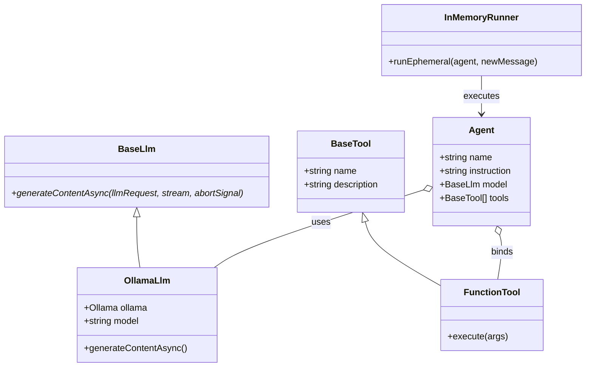

# Workshop Step 04: Google ADK Orchestration & Autonomous Tool Loop

> **Objective:** Integrate Google's official **Agent Development Kit for Node.js (`@google/adk`)**. Implement custom LLM adapters (`BaseLlm`), bind native functions with `FunctionTool`, and orchestrate multi-turn conversational loops with `InMemoryRunner`.

---

## Learning Objectives

By completing this step, you will:
1. Master the official **Google ADK** object model: `Agent`, `BaseLlm`, `FunctionTool`, and `InMemoryRunner`.
2. Implement a custom `BaseLlm` subclass (`OllamaLlm`) that bridges local Ollama streaming with ADK's `generateContentAsync` generator contract.
3. Wrap native JavaScript functions into typed, executable `FunctionTool` objects.
4. Ground prompts with retrieved RAG context before dispatching to the runner.
5. Implement resilient offline fallback modes to serve factual answers even if the LLM daemon is temporarily down.

---

## Google ADK Component Architecture



---

## Directory Structure for Step 4

```
steps/step-04-adk-agent/
├── README.md                 # This detailed guide
├── package.json              # Step dependencies (@google/adk, @google/adk-devtools, ollama)
├── data/
│   └── mutable/              # Live markdown knowledge base
├── krakow_cultural_agent/
│   └── agent.js              # Pure JavaScript rootAgent exported for Google ADK CLI
├── src/
│   ├── agent.js              # Google ADK Agent orchestrator & OllamaLlm
│   ├── ragEngine.js          # Dual-layer RAG engine from Step 2
│   └── tools.js              # Native tools from Step 3
└── test/
    ├── agent.test.js         # Agent lifecycle, tool loops & fallback tests
    ├── ragEngine.test.js     # RAG tests
    └── tools.test.js         # Tool execution tests
```

---

## Hands-on Instructions

### 1. Navigate to the Step Directory

```bash
cd steps/step-04-adk-agent
```

### 2. Configure Environment Variables

```bash
cp .env.example .env
```

### 3. Run the Automated Test Suite

Execute the tests to verify the Google ADK Agent lifecycle:
```bash
npm test
```

**Expected Console Output:**
```text
KrakowCulturalAgent Component Tests
  [PASS] instantiates cleanly with default configuration and @google/adk components (1.6ms)
  [PASS] builds grounded system prompt with RAG citations (7.8ms)
  [PASS] executes tool directly with input arguments (1.7ms)
  [PASS] handles unknown tool execution gracefully without throwing (0.5ms)
  [PASS] provides grounded fallback when Ollama daemon is offline (60.7ms)
  [PASS] loads krakow_cultural_agent/agent.js as pure JavaScript rootAgent for Google ADK CLI (8.0ms)
[PASS] KrakowCulturalAgent Component Tests (73.9ms)
...
INFO: tests 24
INFO: suites 3
INFO: pass 24
INFO: fail 0
```

### 4. Launch the Google ADK Web Dev-UI

To visually inspect the agent graph, tool signatures, and traces in Google ADK's native Web UI:
```bash
npm run adk
# or: npx adk web . --port 8000
```

Open your browser to: **`http://localhost:8000/dev-ui`**. Select `krakow_cultural_agent` to test the agent interactively.

---

## Deep Code Walkthrough (`src/agent.js`)

### 1. Subclassing `BaseLlm` with `OllamaLlm`
In Google ADK, LLM providers implement an `async *generateContentAsync(llmRequest, stream, abortSignal)` generator:
```javascript
import { BaseLlm } from '@google/adk';

export class OllamaLlm extends BaseLlm {
  constructor({
    model = process.env.OLLAMA_MODEL || process.env.MODEL || 'gemma4:e2b',
    host = process.env.OLLAMA_HOST || 'http://127.0.0.1:11434'
  } = {}) {
    super({ model });
    this.host = host;
    this.client = new Ollama({ host });
  }

  async *generateContentAsync(llmRequest, stream, abortSignal) {
    // 1. Transform ADK contents to Ollama chat messages format
    const messages = transformAdkContentsToOllama(llmRequest.contents);
    
    // 2. Format function tools for Ollama
    const tools = formatToolsForOllama(llmRequest.tools);

    // 3. Call local Ollama chat
    const response = await this.ollama.chat({
      model: this.model,
      messages,
      tools
    });

    // 4. Yield ADK LlmResponse with either tool calls or model text
    yield {
      content: {
        role: 'model',
        parts: response.message.tool_calls 
          ? response.message.tool_calls.map(tc => ({ functionCall: { id: tc.id, name: tc.function.name, args: tc.function.arguments } }))
          : [{ text: response.message.content }]
      },
      finishReason: 'STOP',
      turnComplete: true
    };
  }
}
```

### 2. Wrapping Native Tools in `FunctionTool`
```javascript
import { FunctionTool } from '@google/adk';

const functionTools = Object.entries(toolsByName).map(([name, fn]) => {
  const schema = toolDefinitions.find(d => d.function.name === name);
  return new FunctionTool({
    name,
    description: schema.function.description,
    parameters: schema.function.parameters,
    execute: async (args) => {
      return await fn(args);
    }
  });
});
```
*   `FunctionTool` encapsulates validation and execution so the ADK runner can call it automatically when the model requests a function call.

### 3. Running Multi-Turn Loops with `InMemoryRunner`
```javascript
import { Agent, InMemoryRunner } from '@google/adk';

const agent = new Agent({
  name: 'krakow_cultural_agent',
  model: new OllamaLlm(),
  instruction: systemPrompt,
  tools: functionTools
});

const runner = new InMemoryRunner();
const events = await runner.runEphemeral(agent, {
  role: 'user',
  parts: [{ text: userMessage }]
});
```
*   `runEphemeral` handles the autonomous agent loop:
    1. Sends user message + prompt to `OllamaLlm`.
    2. If the model emits `functionCall`, ADK halts text generation, runs `FunctionTool.execute(args)`, feeds the tool result back into the model context, and re-invokes the model until it produces a final `text` answer!

---

## Ready for the Next Step?

Now that the agent reasoning and tool loop are fully functional, our final step is packaging everything into a production application with an Express REST API, single-page web UI, and the official Google ADK Web Dev-UI!

Proceed to **[Step 05: Full Application with Express & Google ADK Dev-UI](../step-05-full-app/README.md)**!
