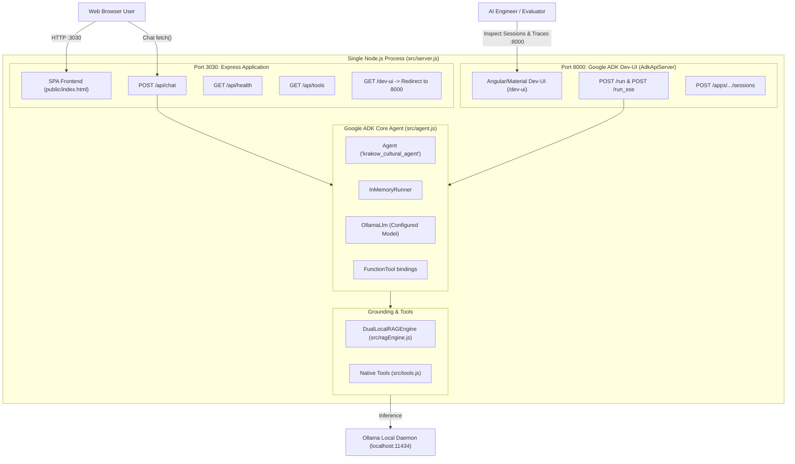

# Workshop Step 05: Full Application with Express & Google ADK Dev-UI

> **Objective:** Assemble the entire production-ready system. Concurrently serve the **Express 5 Single-Page Web App & REST API** on port `3030` alongside the **Official Google ADK Web Dev-UI** on port `8000` in a single, unified Node.js process.

---

## Learning Objectives

By completing this step, you will:
1. Connect the Google ADK Agent (`Agent`, `InMemoryRunner`, `OllamaLlm`) to an Express 5 REST API.
2. Serve a native HTML5/CSS3/JavaScript single-page tour guide frontend without frontend build toolchain overhead (no Vite/Webpack required).
3. Integrate `@google/adk-devtools` (`AdkApiServer`) to run the official Google ADK Web Dev-UI concurrently on port `8000`.
4. Configure session tracing, live RAG inspection, and autonomous tool calling.
5. Execute end-to-end integration tests verifying both web interfaces, RAG citations, and tool dispatches.

---

## End-to-End Architecture



---

## Directory Structure for Step 5

```
steps/step-05-full-app/
├── README.md                      # This detailed guide
├── package.json                   # All dependencies and lifecycle scripts
├── .env.example                   # Environment configuration template
├── data/
│   └── mutable/                   # Live markdown files (pricing, tourist services)
├── krakow_cultural_agent/
│   └── agent.js                   # Pure JavaScript rootAgent exported for Google ADK CLI
├── public/
│   └── index.html                 # Single-page tour concierge web interface
├── src/
│   ├── agent.js                   # ADK Agent and OllamaLlm adapter
│   ├── ragEngine.js               # Dual-layer RAG engine
│   ├── server.js                  # Unified Express + AdkApiServer dual-listener
│   └── tools.js                   # Native tools registry
└── test/
    ├── agent.test.js              # Agent unit tests
    ├── ragEngine.test.js          # RAG tests
    ├── server.test.js             # REST API and dev-ui redirect tests
    └── tools.test.js              # Native tools tests
```

---

## Hands-on Instructions

### 1. Navigate to the Step Directory

```bash
cd steps/step-05-full-app
```

### 2. Configure Environment Variables

```bash
cp .env.example .env
```

Contents of `.env`:
```env
PORT=3030
ADK_PORT=8000
HOST=0.0.0.0
OLLAMA_HOST=http://127.0.0.1:11434
# Configurable via OLLAMA_MODEL (e.g. gemma4:e2b or gemma2:2b)
OLLAMA_MODEL=gemma4:e2b
```

> **Dynamic Model Selection:**  
> The backend automatically inspects `process.env.OLLAMA_MODEL` (or `process.env.MODEL`). The web UI reflects your active model dynamically in its status badge and headers.

### 3. Launch the Unified Production Server

Start the unified server:
```bash
npm start
```

**Console Output:**
```text
+-----------------------------------------------------------------------------+
| ADK API Server started                                                      |
|                                                                             |
| For local testing, access at http://127.0.0.1:8000.                         |
+-----------------------------------------------------------------------------+
Google ADK Web Dev-UI running at: http://127.0.0.1:8000/dev-ui
=======================================================
Kraków Cultural AI Assistant running locally
URL: http://localhost:3030
Google ADK Dev-UI: http://localhost:8000/dev-ui
Local Model: gemma4:e2b via Ollama (http://127.0.0.1:11434)
Mutable RAG Directory: .../data/mutable
=======================================================
```

---

## Interacting with the Applications

### 1. Kraków Tour Concierge Single-Page App
*   Open your browser to: **`http://localhost:3030`**
*   Try the quick-suggestion chips:
    *   *What is the schedule and history of the Hejnał Mariacki trumpet call?*
    *   *Check Wawel Castle ticket availability for tomorrow.*
    *   *What are the official ticket prices and opening hours for Wawel Castle?*
    *   *Recommend an authentic milk bar (bar mleczny) in Old Town.*
*   Notice how the assistant displays:
    *   Tool execution badges (e.g. `Tool Executed: getTrumpetCallSchedule`)
    *   Grounding citations (e.g. `Grounded Source: Wawel Castle State Rooms Pricing`)
    *   Inference duration in milliseconds.

### 2. Official Google ADK Web Dev-UI
*   Open your browser to: **`http://localhost:8000/dev-ui`** (or click the **ADK Dev-UI (Port 8000)** pill in the header of the web app).
*   Select **`krakow_cultural_agent`** from the agent dropdown.
*   Inspect:
    *   **Agent Graph**: Visual representation of the agent, prompt, and tool attachments.
    *   **Trace Viewer**: Step-by-step breakdown of user prompts, model thought turns, tool invocations, and responses.
    *   **State & Session Inspector**: Live memory state.

---

## Running the Full Automated Test Suite

Run all 35 unit and integration tests across the entire stack:
```bash
npm test
```

**Expected Results:**
```text
INFO: tests 35
INFO: suites 4
INFO: pass 35
INFO: fail 0
```

---

## Workshop Summary & Achievements

Congratulations! You have built a complete, production-grade AI agent application from the ground up:
*   **Local Inference**: Gemma 4 running locally via Ollama with low latency and zero API cost.
*   **Dual-Layer RAG**: Lexical search with instant markdown hot reloading.
*   **Native Tool Calling**: Real-time calculations and simulated ticketing inventory.
*   **Google ADK Orchestration**: Custom `BaseLlm`, `FunctionTool`, and `InMemoryRunner`.
*   **Unified Full-Stack App**: Concurrent Express SPA (port 3030) and Google ADK Dev-UI (port 8000).
