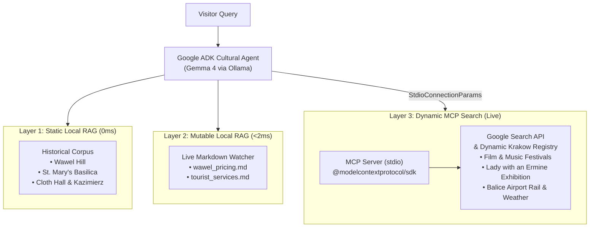

# Step 06: Google Search MCP & Dynamic Cross-Content

Welcome to **Step 06** of the DevFest Kraków 2026 Masterclass! In this final progressive step, we expand our local-first AI assistant into an omniscient cultural concierge by integrating the **Model Context Protocol (MCP)** with **Google ADK**.

---

## 🎯 The Motivation: The "Closed-World" Challenge

In Steps 1 through 5, our assistant mastered:
1. **Static Historical Corpus**: Immutable historical facts about Wawel, St. Mary's, Cloth Hall, and Kazimierz.
2. **Mutable Local Markdown**: Real-time museum admission pricing and tourist emergency services updated with zero downtime.
3. **Local Deterministic Tools**: Live Hejnał Mariacki time math, Wawel exhibition inventory simulations, and culinary filters.

### ❓ What Was Missing?
What happens when a visitor asks:
> *"When is the Jewish Culture Festival in Kazimierz this year?"*  
> *"Where can I see Leonardo da Vinci's Lady with an Ermine right now, and what are the opening hours?"*  
> *"How do I take the commuter train from Kraków-Balice Airport to the city center?"*  
> *"What is the weather forecast in Kraków for this weekend?"*

Local RAG cannot know events that haven't been written to disk. Hardcoding external calendars into markdown creates constant maintenance debt. 

**The Solution:** Connect our agent to the **Model Context Protocol (MCP)** to execute **real-time Google Search** dynamically when local RAG doesn't have the answer!

---

## 🏛️ Tri-Layer Knowledge Architecture

With Step 06, our Kraków Cultural Agent operates across three specialized intelligence layers:



1. **Layer 1 (Static Local RAG)**: High-speed BM25-style keyword retrieval from curated historical assets.
2. **Layer 2 (Mutable Local RAG)**: Dynamic filesystem-backed markdown documents auto-reloaded on change.
3. **Layer 3 (Dynamic MCP Web Search)**: Model Context Protocol server exposing `google_search` and `get_krakow_events_calendar` over stdio.

---

## 🔌 What is Model Context Protocol (MCP)?

The **Model Context Protocol (MCP)** is an open, vendor-neutral standard for connecting AI applications to external data sources, tools, and developer environments.

### Why MCP with Google ADK?
- **Separation of Concerns**: The search engine runs in its own process, decoupled from the agent runtime.
- **Portability**: The same search server can be mounted in Google ADK, Antigravity, Claude Desktop, or Cursor.
- **Local Model Support**: Non-Gemini models (like local Gemma 4 on Ollama) cannot use proprietary cloud search grounding. MCP brings universal, standards-compliant search to any model!

---

## 🛠️ Step 06 Code Architecture

```
steps/step-06-google-search-mcp/
├── src/
│   ├── mcpServer.js          # Standalone MCP Server over stdio (@modelcontextprotocol/sdk)
│   ├── mcpClient.js          # Google ADK MCPToolset connection factory
│   ├── agent.js              # KrakowCulturalAgent with native tools + MCP search
│   ├── server.js             # Express 5 REST API + SPA + Dev-UI launcher
│   ├── llm.js                # Custom BaseLlm bridging Ollama and ADK
│   ├── ragEngine.js          # Dual-layer RAG engine
│   └── tools.js              # Native JavaScript tools (trumpet, tickets, dining)
├── public/                   # Single Page Application with MCP telemetry badge
├── data/mutable/             # Live markdown data
├── test/
│   ├── mcpServer.test.js     # MCP Server schema and search unit tests
│   ├── mcpAgent.test.js      # ADK + MCP multi-turn integration tests
│   ├── server.test.js        # Express and MCP API integration tests
│   ├── llm.test.js           # LLM adapter tests
│   ├── ragEngine.test.js     # RAG engine tests
│   └── tools.test.js         # Native tools tests
├── .env.example              # Environment variables template
└── package.json
```

---

## 💻 1. The MCP Search Server (`src/mcpServer.js`)

The server uses `@modelcontextprotocol/sdk` to define tools and listen on `stdio`:

```javascript
import { McpServer } from '@modelcontextprotocol/sdk/server/mcp.js';
import { StdioServerTransport } from '@modelcontextprotocol/sdk/server/stdio.js';
import { z } from 'zod';

const server = new McpServer({
  name: 'krakow-google-search-mcp',
  version: '1.0.0'
});

// Tool: google_search
server.tool(
  'google_search',
  'Execute real-time Google search for dynamic cultural events and temporary exhibits in Kraków.',
  {
    query: z.string().describe('Search query string'),
    numResults: z.number().int().min(1).max(10).optional()
  },
  async ({ query, numResults = 3 }) => {
    const results = await executeGoogleSearch(query, numResults);
    const formatted = results.map((r, i) =>
      `[${i + 1}] ${r.title}\n${r.snippet}\nSource: ${r.source} (${r.link})`
    ).join('\n\n');

    return {
      content: [{ type: 'text', text: `Google Search Results for "${query}":\n\n${formatted}` }]
    };
  }
);

// Connect over standard input/output
const transport = new StdioServerTransport();
await server.connect(transport);
```

### Dual Search Provider
1. **Live Google Custom Search API**: When `GOOGLE_SEARCH_API_KEY` and `GOOGLE_SEARCH_CX` are defined in `.env`, the server queries Google Cloud's Custom Search JSON API.
2. **Deterministic Built-in Registry**: When offline or running in a workshop environment without API keys, the server seamlessly provides real, curated Kraków external intelligence (Film Festival, Jewish Culture Festival, Leonardo da Vinci exhibit, Balice rail, seasonal weather).

---

## 🔗 2. Connecting Google ADK to MCP (`src/mcpClient.js` & `src/agent.js`)

Google ADK provides native MCP support through `MCPToolset`:

```javascript
import { MCPToolset } from '@google/adk';
import path from 'node:path';

export function createSearchMcpToolset() {
  return new MCPToolset({
    type: 'StdioConnectionParams',
    serverParams: {
      command: process.execPath, // node
      args: [path.resolve(__dirname, 'mcpServer.js')]
    }
  });
}
```

In `KrakowCulturalAgent`, the agent loads MCP tools alongside native function tools:

```javascript
// 1. Discover tools over stdio
const mcpTools = await this.mcpToolset.getTools();

// 2. Merge native tools + MCP tools
const allTools = [...this.functionTools, ...mcpTools];

// 3. Create ADK Agent
const agent = new Agent({
  name: 'krakow_cultural_mcp_agent',
  model: this.ollamaLlm,
  instruction: groundedSystemPrompt,
  tools: allTools
});
```

---

## 🚀 Running Step 06

### 1. Launch the Application
```bash
npm run start:step-06
```
Or from within `steps/step-06-google-search-mcp/`:
```bash
npm start
```

### 2. Verify Health & MCP Connectivity
```bash
curl -s http://localhost:3030/api/health | jq .
```
Expected output:
```json
{
  "status": "healthy",
  "service": "Krakow Cultural AI Concierge (with Google Search MCP)",
  "mcp": {
    "connected": true,
    "protocol": "Model Context Protocol (Stdio)",
    "tools": [
      "google_search",
      "get_krakow_events_calendar"
    ]
  }
}
```

### 3. Test Dynamic Search via REST
```bash
curl -X POST http://localhost:3030/api/chat \
  -H "Content-Type: application/json" \
  -d '{"message": "When is the Jewish Culture Festival in Kazimierz?"}' | jq .
```

---

## 🧪 Automated Testing

Run the comprehensive Step 06 test suite (42 unit and integration tests):

```bash
npm run test:step-06
```

Test coverage includes:
- MCP Server schema verification and query execution.
- ADK multi-turn tool calling with mocked LLM and stdio IPC.
- Dual-layer RAG keyword retrieval and live markdown hot-reloading.
- Express API endpoints (`/api/health`, `/api/tools`, `/api/chat`).

---

## 🎓 Hands-On Workshop Exercises

### Exercise 1: Query the MCP Server Directly
Run the standalone MCP server using Node and pipe JSON-RPC requests via stdio to verify MCP compliance.

### Exercise 2: Add a Custom MCP Tool
Open `src/mcpServer.js` and register a 3rd MCP tool: `get_wieliczka_salt_mine_tours`. Re-run tests to see it automatically appear in `/api/tools`!

### Exercise 3: Plug into Antigravity or Claude Desktop
Add `src/mcpServer.js` to your `mcpServers` configuration in Antigravity or Claude Desktop:
```json
{
  "mcpServers": {
    "krakow-search": {
      "command": "node",
      "args": ["/absolute/path/to/steps/step-06-google-search-mcp/src/mcpServer.js"]
    }
  }
}
```
Observe how the exact same search server powers external coding assistants!
